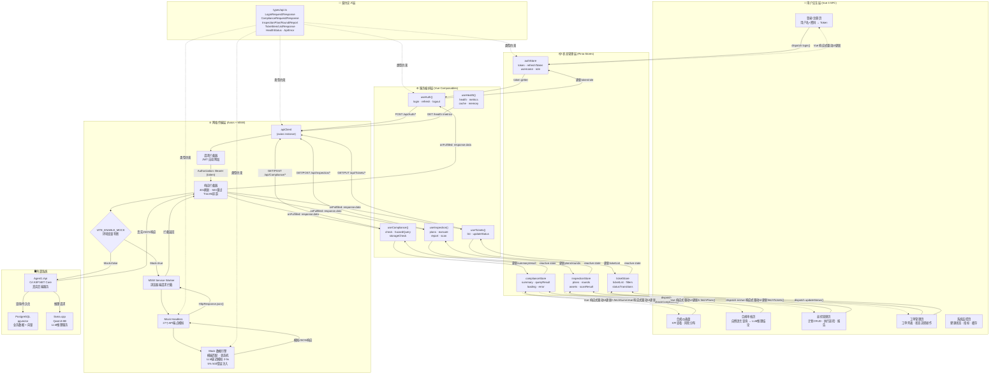

基于之前的分析，我将绘制 Agent1 前端系统的完整a交互逻辑架构图：



---

## 交互逻辑分步说明

### 第一步：用户触发操作

用户通过 Vue 3 SFC 组件发起操作（点击按钮、提交表单、页面加载），触发 Pinia Store 中的 action：

```
用户点击"提交合规查询"
  → CompliancePage.vue: @click="checkCompliance()"
  → complianceStore.dispatch('checkCompliance', { query: '苯和丙酮能同库吗' })
```

### 第二步：状态管理层调度

Pinia Store 的 action 调用对应的 Composable（基于 `@tanstack/vue-query`），管理请求的加载态、缓存、重试：

```
complianceStore.checkCompliance(query)
  → useComplianceCheck().mutate({ query })
  → mutationFn: (req) => apiClient.post('/api/Compliance/check', req)
```

### 第三步：网络层拦截链

请求经过 Axios 拦截器链处理：

```
apiClient.post('/api/Compliance/check', body)
  → [请求拦截器] 自动附加 JWT: Authorization: Bearer {token}
  → [MSW判断] VITE_ENABLE_MOCK === 'true' ?
```

### 第四步：模式分叉

**Mock 模式** → MSW Service Worker 在浏览器端拦截 `fetch` 请求，网线根本没有发出：
```
MSW → handlers.ts → simulateLlmDelay() 2-5s → getComplianceResponse(query)
   → 模板匹配: '苯+丙酮' → 返回预定义合规结论
   → HttpResponse.json(complianceResponse)
```

**真实模式** → 请求直连 Agent1.Api：
```
Agent1.Api → [Authorize] JWT验证 → ComplianceController.CheckCompliance()
  → 缓存查询 → LLM并发门控(SemaphoreSlim) → AgentDialog.ExecuteEvalFastAsync()
  → llama.cpp推理 → ConclusionVerifier验证 → ComplianceResponse
```

### 第五步：响应回流 → UI 更新

无论 Mock 还是真实路径，响应通过 Vue 响应式系统驱动 UI 自动更新：

```
Axios 响应 → Composable mutation onSuccess
  → complianceStore.queryResult = response.data
  → Vue 响应式追踪 → CompliancePage.vue 自动重新渲染
    → <MarkdownViewer :content="result.response" />
    → <RegulationList :items="result.verifiedRegulations" />
    → <WarningBanner :warnings="result.warnings" />
```

### 第六步：错误处理路径

```
[401] → 响应拦截器 → Token刷新队列 → POST /api/Auth/refresh
  → 成功: 重放失败请求 → UI无感知恢复
  → 失败: onLogout() → window.location = '/login'

[503] → 响应拦截器 → 自动重试(最多2次) → retryAfter延迟
  → 成功: UI无感知恢复
  → 失败: 显示"服务繁忙"提示

[400/500] → Composable onError → 显示错误Toast/消息
```

---

## 关键设计特点

| 设计点             | 实现方式                                         | 价值                                 |
| ------------------ | ------------------------------------------------ | ------------------------------------ |
| **零代码切换**     | 环境变量 `VITE_ENABLE_MOCK` 控制，业务代码不感知 | Mock ↔ 真实 API 无需改一行组件代码   |
| **类型安全**       | `types/api.ts` 契约层统一约束所有层              | 编译期捕获字段不匹配                 |
| **网络层透明拦截** | MSW Service Worker 在浏览器 `fetch` 层拦截       | 不侵入 Axios/Vue/Composable 任何一层 |
| **Token 自动管理** | Axios 拦截器自动附加 JWT + 401 自动刷新          | Vue 组件无需手动处理认证             |
| **LLM 延迟模拟**   | `simulateLlmDelay()` + `maybeSimulateError()`    | 前端可独立开发进度条/超时/重试逻辑   |
| **状态机驱动**     | Tickets 状态流转引擎 (7态) 在 Mock 层实现        | 不依赖后端即可测试完整工单生命周期   |