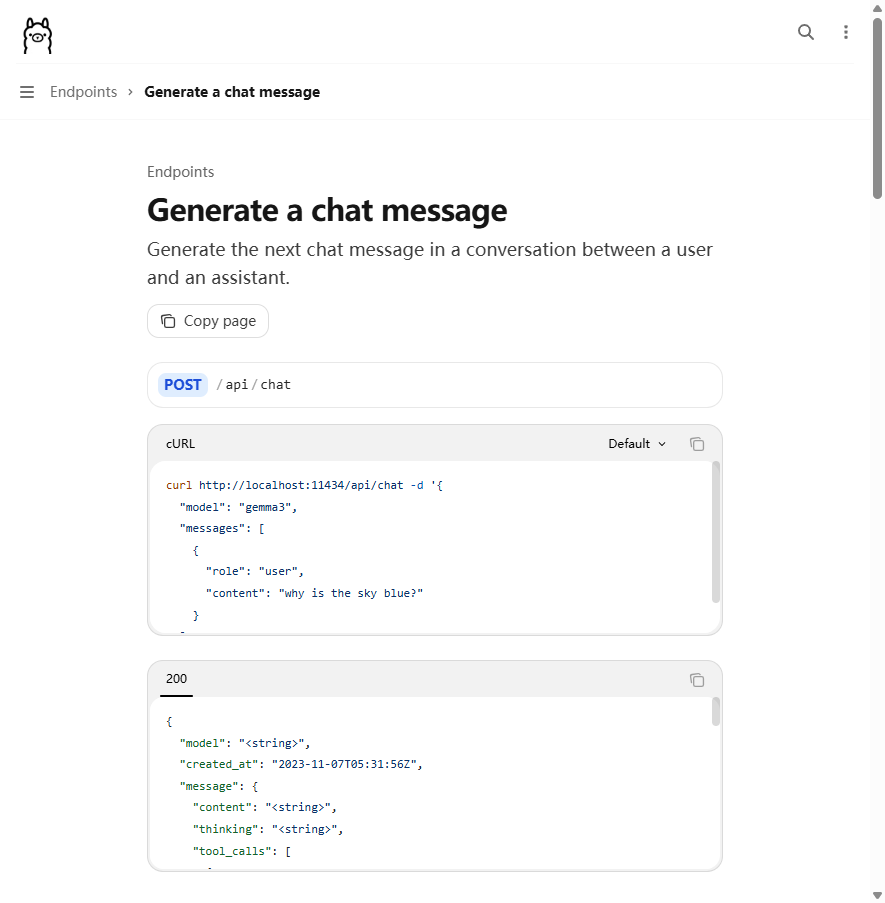
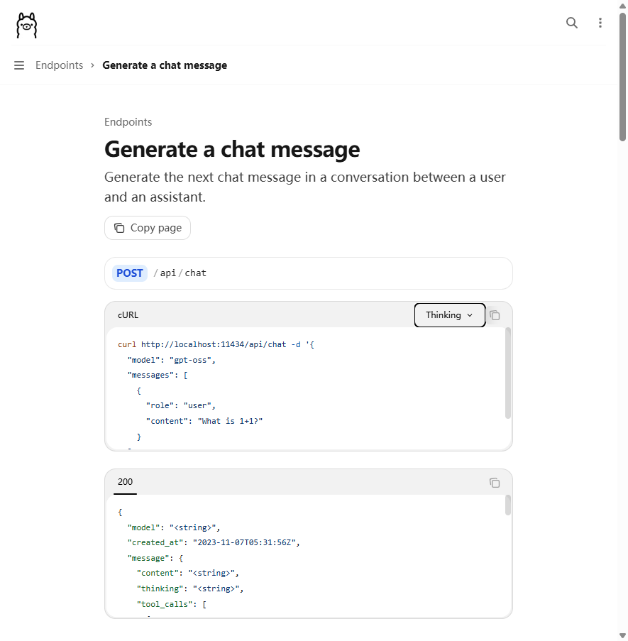

# [Semantic Kernel] 如何优雅地向 Ollama 请求注入 `think` 参数？

我在使用 **Semantic Kernel + Ollama + Qwen3-8B** 构建化工合规审核 Agent 时，遇到了 Qwen3 默认开启思考（thinking）模式导致响应超时的问题。由于 SK 的 Ollama 连接器没有公开暴露 `think` 参数的设置入口，最终通过**递归反射穿透 SK 内部对象图**来注入自定义 `DelegatingHandler`，在 HTTP 层拦截请求并注入 `think` 参数。

本文梳理了问题背景、SK 设计意图分析、递归反射方案的实现原理与加固措施、以及几种可选方案的对比，为遇到同类问题的开发者提供参考。

> **勘误记录**：
> 1. 本文初版曾误将 Ollama 参数写为 `enable_thinking`（位于 `options` 内部），经官方文档核实，正确参数为 `think`（位于请求体**根级别**），已于文中修正。
> 2. 初版反射链路描述为 `OllamaChatCompletionService._httpClient`，经验证 SK 1.74.0-alpha 实际架构为装饰器模式：`ChatClientChatCompletionService → KernelFunctionInvokingChatClient(InnerClient属性) → OllamaApiClient._client`，已修正。

---

## 1. 问题背景

### 1.1 运行环境

| 组件 | 版本 / 规格 |
| :--- | :--- |
| .NET Runtime | .NET 8 |
| Semantic Kernel | `Microsoft.SemanticKernel.Connectors.Ollama` (预览版) |
| Ollama | 本地部署，CPU 推理 |
| 模型 | `qwen3:8b`（Q4_K_M 量化） |
| 硬件 | 纯 CPU，无 GPU 加速 |

### 1.2 现象

Qwen3 模型默认启用 **thinking（思考）模式**。在该模式下，模型会先在响应中输出一段 `<think>...</think>` 包裹的推理过程，然后才给出正式回答。

在纯 CPU 推理环境下，这段额外的思考过程会带来两个严重问题：

1. **响应延迟急剧增大** — 原本 30-60 秒就能完成的合规审核请求，因 thinking 过程膨胀到 3-5 分钟，触发 Ollama runner 内部约 100 秒的请求超时。
2. **Token 消耗翻倍** — 每条请求的 thinking token 与 answer token 都会被计费/消耗，对于需要频繁调用 LLM 的 RAG + ReAct 多轮推理管道来说，成本难以接受。

因此，我们需要在**不需要推理过程展示的场景**中，向 Ollama API 请求体注入 `"think": false` 参数来关闭思考模式。

### 1.3 Ollama API 层面该如何做？

根据 [Ollama 官方 API 文档](https://docs.ollama.com/api/chat)，`think` 是 `/api/chat` 端点 **ChatRequest schema 的根级别参数**（与 `model`、`messages`、`stream` 同级），而非 `options` 子对象的属性。

**官方文档参数定义如下：**



> 截图来源：[docs.ollama.com/api/chat](https://docs.ollama.com/api/chat)，`think` 字段类型为 `boolean`（可选 `"high"`/`"medium"`/`"low"` 字符串），描述为 *"When true, returns separate thinking output in addition to content"*。

**官方 Thinking 代码示例：**



> 截图来源：同上页面 "Thinking" 代码示例标签，可见 `"think": "low"` 位于请求体根级别，与 `model`、`messages` 同级。

因此，关闭思考模式的正确请求体为：

```json
{
  "model": "qwen3:8b",
  "messages": [...],
  "stream": true,
  "think": false
}
```

> **关键区分**：`think` 是 `ChatRequest` 的**根级别参数**，不是 `options` 子对象的属性。`options` 用于 `temperature`、`num_ctx` 等运行时调优参数，而 `think` 是独立的功能开关。这一点对后续反射注入的实现至关重要——注入位置错了，参数就会被 Ollama 忽略。

---

## 2. 核心矛盾：SK 没有暴露 `think` 参数的 API

Semantic Kernel 1.74.0-alpha 引入了 Microsoft.Extensions.AI 抽象层，实际架构是装饰器模式：

```
ChatClientChatCompletionService   ← SK 包装层
  └→ _chatClient: KernelFunctionInvokingChatClient  ← Function Calling 编排层
       └→ InnerClient (属性): OllamaApiClient       ← Ollama 原生客户端
            └→ _client (HttpClient)                 ← 真正发请求的 HttpClient
```

`OllamaApiClient` 内部通过 `HttpClient` 构建请求体时，只映射了 Ollama ChatRequest schema 中的**标准字段**：

```csharp
// SK 内部大致逻辑（简化）
var request = new
{
    model = modelId,
    messages = [...],
    stream = true,
    options = new           // 运行时调优参数
    {
        temperature = ...,
        top_p = ...,
        num_predict = ...,
        stop = [...]
    }
    // 没有 think 字段！   ← 根级别参数，SK 未映射
};
```

SK 官方目前**没有提供公开 API** 来向请求体注入根级别的自定义参数——无论是 `PromptExecutionSettings` 还是 `OllamaPromptExecutionSettings`，都没有类似 `ExtraBody` 或 `AdditionalOptions` 这样的字典属性。

**但这不意味着完全无法实现**：`OllamaApiClient` 内部通过 `HttpClient` 发请求，而 .NET 的 `DelegatingHandler` 管道本就是 HTTP 层的标准扩展点。问题的核心在于**如何拿到那个内部的 `HttpClient` 引用**——SK 没有公开暴露它，所以只能通过反射绕过封装。

换言之：**扩展机制本身存在（`DelegatingHandler`），只是进入入口被 SK 隐藏在私有字段后面。** 这正是我们第 3 节探讨的反射方案所解决的问题。

---

## 3. 当前方案：反射注入（能用但脆弱）

### 3.1 实现原理

SK 1.74.0-alpha 的实际对象链路是装饰器模式（见§2），我们无法直接通过单一字段名定位 `HttpClient`。因此采用**递归搜索策略**：同时扫描私有字段和公开属性，沿着对象图逐层深入，直到找到 `HttpClient` 实例。

```csharp
// 递归搜索逻辑（简化）
(object owner, FieldInfo field)? FindHttpClient(object obj, int depth, int maxDepth)
{
    var type = obj.GetType();
    // 1. 搜索私有字段
    foreach (var f in type.GetFields(NonPublic | Instance))
        if (f.GetValue(obj) is HttpClient) return (obj, f);
    // 2. 搜索公开属性（装饰器的 InnerClient）
    foreach (var p in type.GetProperties(All))
        // 递归进入子对象...
    // 3. 递归深入子对象
    // ...
}
```

找到 `HttpClient` 后，用携带 `OllamaThinkingHandler` 的新 `HttpClient` 替换它，即可在请求发出前修改 JSON body。

### 3.2 优点

- **无需额外依赖包**，直接利用现有基础设施。
- **实现高效**，代码量少，对现有架构侵入小。
- **保持 SK 集成度**，无需放弃 SK 的 Function Calling、插件系统等核心能力。

### 3.3 风险与不足

1. **反射依赖多层私有结构** — 字段名、属性名、装饰器层数任一变化，反射代码都可能失效。SK 1.74.0-alpha 引入了 Microsoft.Extensions.AI 装饰器模式，比旧版复杂得多。但递归搜索策略（同时扫描字段+属性，最多 5 层深度）已在当前版本验证通过，并对 SK 内部结构变化具备一定的自适应能力。
2. **预览版 SDK 不稳定** — `Microsoft.SemanticKernel.Connectors.Ollama` 目前仍是预览版，内部 API 变更频繁。
3. **无编译期安全保障** — 反射错误只能在运行时暴露，容易造成生产事故。
4. **字段初始化时机不确定** — SK 可能在首次调用时才初始化 `HttpClient`，过早反射可能拿到 null。

### 3.4 已实施的加固措施

针对上述风险，我们已经在当前方案中加入了以下防护：

| 加固措施 | 说明 |
| :--- | :--- |
| **惰性加载** | 不在 SK 构建时获取 `HttpClient`，而是在第一次 HTTP 请求前通过拦截器延迟获取。 |
| **回退机制** | 反射失败时静默捕获异常，记录详细错误日志，程序继续以默认行为运行（不注入）。 |
| **逻辑封装** | 所有反射逻辑封装在独立辅助类中，与业务代码完全隔离。 |
| **运行时验证** | 发送轻量 `ping` 请求，检查响应中是否包含 `<think>` 标签，作为双重保险。 |
| **BaseAddress 保底** | 替换 HttpClient 时必须显式设置 `BaseAddress = ModelConfig.Endpoint`（末尾加 `/`），否则 SK 内部使用相对 URI（`/api/chat`）时会抛出 `An invalid request URI was provided`。详见 §7.2。 |

> **🔴 实战踩坑记录（2026-06-04）**：加固措施表最初缺少 BaseAddress 保底。在评测系统（非流式调用）上线后，`InjectThinkingHandler` 创建的新 `HttpClient` 未设置 `BaseAddress`，导致所有评测请求抛出 `An invalid request URI was provided`。根因：SK 内部 Ollama 连接器使用相对 URI 构造请求，替换 HttpClient 后丢失了原始 `BaseAddress`。修复后已在表中补充此项。

以上加固措施已在当前项目（SK 1.74.0-alpha + Qwen3-8B + CPU 推理）中实际运行并通过 49 条合规评测验证。

---

## 4. 可选替代方案分析

### 方案 A：基于 `HttpClient` 的自定义注入

**思路**：使用 SK 的 `AddOllamaChatCompletion` 重载，注入自定义 `HttpClient`（`BaseAddress` 指向本地 Ollama），通过 `DelegatingHandler` 拦截请求并修改 body。

```csharp
services.AddHttpClient("OllamaWithThinking", client =>
{
    client.BaseAddress = new Uri("http://localhost:11434");
})
.AddHttpMessageHandler<ThinkingModeHandler>(); // 自定义 DelegatingHandler
```

**优点**：
- 不依赖反射，是官方支持的 `HttpClient` 注入方式。
- 可以完全控制 HTTP 管道，实现请求/响应日志、Header 修改等。

**缺点**：
- 需要模拟 OpenAI 端点格式，增加了不必要的复杂度。
- **仍然强烈依赖 SK 的 Ollama 连接器内部实现**——body 的 JSON 结构、字段名等仍然由 SK 内部构建，你无法控制。
- 实际上并未降低对 SK 连接器的耦合，维护成本可能与反射方案持平甚至更高。

### 方案 B：替换为 `OllamaSharp`

**思路**：放弃 SK 的 Ollama 连接器，改用社区库 `OllamaSharp` 直接与 Ollama 交互。`OllamaSharp` 官方提供了 `Think` 属性。

**优点**：
- 官方支持 `think` 参数，稳定可靠。
- 无反射，无 SDK 内部依赖风险。

**缺点**：
- **完全放弃 SK 集成**：需要自行实现 Function Calling 编排、插件系统、会话管理等，业务侵入成本极高。
- 整个应用直接与 Ollama 耦合，丧失了 SK 的模型无关抽象优势。
- 对于我们的场景（RAG + ReAct + Function Calling），自行编排的工作量和风险都不可接受。

### 方案 C：向 SK 提交 PR，贡献 `think` 参数映射

**思路**：向 [Semantic Kernel 仓库](https://github.com/microsoft/semantic-kernel) 提交 PR，在 `OllamaPromptExecutionSettings` 中添加 `Think` 属性并在序列化时映射到 `ChatRequest` 根级别的 `think` 字段。

**优点**：
- 一旦合入，将是**一劳永逸**的官方方案，所有 SK + Ollama 用户受益。
- 实现量不大——只需在 `ChatRequest` 类中添加 `think` 字段并在 connector 中映射，OpenAI connector 的 `extra_body` 机制可以作为参考。

**缺点**：
- PR 审阅和合入周期不确定，可能需要数周。
- 需要英文沟通和遵循 SK 的贡献规范。

---

## 5. 方案对比总结

| 方案 | 维护成本 | SK 集成度 | 稳定性风险 | 推荐度 |
| :--- | :--- | :--- | :--- | :--- |
| **反射注入（当前 + 加固）** | 低 | 高 | 中（可控） | ⭐⭐⭐⭐ |
| **HttpClient 注入** | 高 | 高 | 高 | ⭐⭐ |
| **OllamaSharp 替换** | 极高 | 无 | 低 | ⭐ |
| **向 SK 提交 PR 贡献** | — | — | — | ⭐⭐⭐⭐⭐ |

---

## 6. 设计反思：SK 为什么会这样设计？

有人可能会问：SK 团队为什么不直接暴露出 `HttpClient` 或者给 `OllamaPromptExecutionSettings` 加个 `AdditionalOptions` 字典？

这其实涉及 SK 的核心设计哲学——**模型无关抽象**。SK 的设计目标是让你写 `kernel.InvokePromptAsync(...`，而不需要关心底层是 OpenAI、Ollama 还是 Azure。`HttpClient` 是 Ollama 专属的实现细节，暴露它意味着打破统一抽象。

而 `think` 参数之所以没被映射，根本原因是 **Ollama 连接器在 SK 的优先级排序中排在靠后的位置**——目前仍是 `-alpha` 标签，而 OpenAI 连接器早已支持 `extra_body` 等扩展参数。这不是技术上做不到，只是还没排上优先级的 backlog。

理解这一点之后，我们对反射方案的态度应该是：

- **短期（当前版本）**：递归反射是务实的选择——`DelegatingHandler` 是 .NET HTTP 管道的标准扩展点，只是进入入口被 SK 藏在私有字段后面。递归搜索策略（字段 + 属性，最多 5 层）已经在 SK 1.74.0-alpha 上验证通过，并对 SDK 内部结构变化具备一定的自适应能力。
- **长期（SK 稳定版）**：关注 SK 的 `OllamaPromptExecutionSettings` 是否会引入类似 `extra_body` 的扩展槽。如果计划长期使用 SK + Ollama 组合，向 SK 提交 PR 贡献 `think` 参数映射是最彻底的解决方案。
- **终极方案**：如果模型无关抽象的需求弱于协议控制需求（即你的项目已经确定用 Ollama 且不会换），`OllamaSharp` 也是值得考虑的选项，但要意识到放弃 SK 集成度的代价。

---

## 7. 附录：关键代码片段

### 7.1 Ollama Modelfile 尝试（无效）

最初尝试在 Modelfile 中设置：

```dockerfile
FROM qwen3:8b
PARAMETER num_ctx 4096
PARAMETER num_predict -1
PARAMETER think false
```

但 Ollama 的 Modelfile `PARAMETER` 指令并**不支持 `think` 参数**——它只能设置 `num_ctx`、`temperature` 等标准参数，`think` 只能在 API 请求时指定。

### 7.2 当前反射注入核心逻辑（简化）

```csharp
internal class OllamaThinkingHandler : DelegatingHandler
{
    private readonly LlmService _owner;

    public OllamaThinkingHandler(LlmService owner) : base(new HttpClientHandler())
    {
        _owner = owner;
    }

    protected override async Task<HttpResponseMessage> SendAsync(
        HttpRequestMessage request, CancellationToken cancellationToken)
    {
        if (request.Content != null
            && request.RequestUri?.AbsolutePath.Contains("/api/chat") == true)
        {
            var body = await request.Content.ReadAsStringAsync(cancellationToken);

            // 仅在 JSON body 中不存在 think 参数时才注入
            if (!body.Contains("\"think\""))
            {
                var trimmed = body.TrimEnd();
                if (trimmed.EndsWith("}"))
                {
                    var enableValue = _owner.EnableThinking ? "true" : "false";
                    // 在请求体根级别插入 "think": true/false
                    var newBody = trimmed.Substring(0, trimmed.Length - 1)
                        + $",\"think\":{enableValue}" + "}";
                    request.Content = new StringContent(
                        newBody, Encoding.UTF8, "application/json");
                }
            }
        }

        return await base.SendAsync(request, cancellationToken);
    }
}
```

> **注入位置说明**：`think` 注入到 JSON body 的**根级别**（与 `model`、`messages`、`stream` 同级），而非 `options` 子对象内部。这是因为 Ollama API 的 `think` 是 `ChatRequest` 的一级属性，不是运行时调优参数。

**反射注入链路（已验证）**：`Kernel` → `IChatCompletionService`(`ChatClientChatCompletionService`) → 递归搜索字段/属性 → `_chatClient`(`KernelFunctionInvokingChatClient`) → `InnerClient`(属性) → `OllamaApiClient` → `_client`(HttpClient) → 替换为携带 `OllamaThinkingHandler` 的新 `HttpClient`。递归搜索最多 5 层，失败时静默降级，不影响程序运行。

#### 🛡️ HttpClient 替换代码（含 BaseAddress 保底）

替换 `OllamaApiClient._client` 时，**必须显式设置 `BaseAddress`**，否则 SK 使用相对 URI 发请求时会失败：

```csharp
// InjectThinkingHandler 中替换 HttpClient 的正确写法
var baseAddr = ModelConfig.Endpoint;              // http://localhost:11434
if (!baseAddr.AbsoluteUri.EndsWith("/"))
    baseAddr = new Uri(baseAddr.AbsoluteUri + "/"); // 尾部斜杠确保与相对路径正确拼接

var newHttpClient = new HttpClient(handler)
{
    Timeout = TimeSpan.FromMinutes(15),
    BaseAddress = baseAddr   // ⚠️ 必须设置！SK 内部使用 /api/chat 等相对 URI
};
httpClientField.SetValue(owner, newHttpClient);
```

> **🔴 踩坑警告**：初次实现时漏掉了 `BaseAddress`，导致流式调用（`InvokePromptStreamingAsync`）正常工作，但非流式调用（`InvokePromptAsync`）抛出 `An invalid request URI was provided`。这是因为 SK 的流式和非流式路径在构造请求 URI 时行为略有差异，流式路径可能使用了绝对 URI，而非流式路径依赖 `HttpClient.BaseAddress`。无论哪种情况，设置 `BaseAddress` 都是正确的做法。

### 7.3 诊断技巧：如何反向探查 NuGet 包的内部结构？

在解决这个问题的过程中，一个关键的挑战是：SK 1.74.0-alpha 的内部架构发生了重大变化（引入了 Microsoft.Extensions.AI 装饰器模式），旧代码中硬编码的字段名 `_client` 和 `_httpClient` 已经不存在了。我们需要知道**新的内部类型和字段名是什么**，才能写出正确的反射代码。

这里用到一个非常实用的 .NET 诊断技巧——**直接加载 NuGet 包的 DLL 并通过反射探查其内部结构**。

#### 方法 1：通过运行时诊断代码探查（推荐）

最可靠的方式是在运行中的应用程序里嵌入诊断代码，直接打印内部字段和属性列表：

```csharp
// 在 InjectThinkingHandler 中临时加入诊断代码
var type = chatService.GetType();
var fields = type.GetFields(BindingFlags.NonPublic | BindingFlags.Instance);
foreach (var f in fields)
    Console.WriteLine($"字段: {f.FieldType.Name} {f.Name}");

var props = type.GetProperties(BindingFlags.Public | BindingFlags.Instance);
foreach (var p in props)
    Console.WriteLine($"属性: {p.PropertyType.Name} {p.Name}");
```

因为代码运行在宿主进程中，所有依赖都已正确加载，不会有缺失程序集的问题。我们正是用这个方法发现了 `ChatClientChatCompletionService._chatClient` → `KernelFunctionInvokingChatClient` → `InnerClient` → `OllamaApiClient._client` 的实际链路。

实际诊断输出：

```
🔍 [Thinking诊断] ChatClientChatCompletionService 共 2 个非公开字段:
   → IChatClient _chatClient                     ← 入口！
   → IReadOnlyDictionary 2 <Attributes>k__BackingField
   [层1] KernelFunctionInvokingChatClient → 0 字段  ← 没有私有字段！
   属性: IChatClient InnerClient = OllamaApiClient   ← 通过属性暴露
   [层2] OllamaApiClient → 9 字段
   字段: HttpClient _client = HttpClient             ← 找到了！
```

关键发现：`KernelFunctionInvokingChatClient` 是一个**零字段类**，所有内部客户端都通过公开属性 `InnerClient` 暴露——这就是为什么仅搜索私有字段会失败。这也直接催生了"字段 + 属性双通道递归搜索"的策略。

#### 方法 2：PowerShell 直接加载 DLL（有门槛）

另一种思路是直接加载 NuGet 缓存中的 DLL：

```powershell
# 定位 NuGet 包缓存路径
$dll = "$env:USERPROFILE\.nuget\packages\microsoft.semantickernel.connectors.ollama\
        1.74.0-alpha\lib\net8.0\Microsoft.SemanticKernel.Connectors.Ollama.dll"

$asm = [System.Reflection.Assembly]::LoadFrom($dll)
$type = $asm.GetType("命名空间.OllamaChatCompletionService")
$type.GetFields("NonPublic,Instance") | ForEach-Object { $_.Name }
```

**但这个方法有一个常见的坑**：如果 DLL 依赖了其他程序集（如 `Microsoft.Extensions.AI`），PowerShell 可能因依赖解析失败而抛出 `ReflectionTypeLoadException`，导致所有类型都加载不出来。这种情况下，方法 1（运行时诊断）才是正确的路径。

#### 方法 3：ILSpy / dnSpy 图形化反编译

如果不想写代码，也可以用 [ILSpy](https://github.com/icsharpcode/ILSpy) 或 [dnSpy](https://github.com/dnSpy/dnSpy) 打开 DLL 文件，图形化浏览所有类型、字段、属性和方法。这对于一次性快速探查特别方便。

#### 通用诊断流程总结

当需要反射访问某个 NuGet 包的内部实现时，推荐的诊断流程是：

1. **运行时诊断优先**——在应用中嵌入诊断代码，打印字段和属性列表（最可靠）
2. **反编译工具辅助**——用 ILSpy/dnSpy 确认类型结构和依赖关系
3. **PowerShell 兜底**——仅在 DLL 无外部依赖时可行

这个技巧不仅适用于 SK，对任何需要理解第三方库内部结构的场景都适用——比如排查 ASP.NET Core 中间件行为、调试 EF Core 查询生成逻辑等。

---

> **作者**：一名在工业 AI 领域摸爬滚打的 .NET 开发者  
> **项目背景**：化工园区危化品合规审核 AI Agent（.NET 8 + Semantic Kernel + Ollama + PostgreSQL + pgvector）

---

