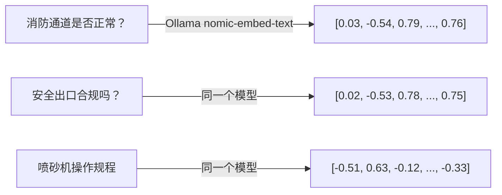

先从最基础的 Embedding 讲起，然后按时间线回顾 K1→K9 及之后的所有问题。

---

## 一、Embedding 到底是什么？

**一句话：把文字变成一串数（768个），语义相近的文字，数也相近。**



- "消防通道"和"安全出口"的向量夹角很小 → **语义相近**
- "消防通道"和"喷砂机"的向量夹角很大 → **语义无关**

PostgreSQL 的 `pgvector` 插件就干这个：用 HNSW 索引从几万条向量中快速找到夹角最小的几条。

**为什么要两套检索（BM25 + 向量）？**

|              | BM25                                     | 向量                             |
| ------------ | ---------------------------------------- | -------------------------------- |
| 怎么找       | 拆词逐字匹配                             | 语义向量夹角                     |
| 查"消防通道" | 精确命中含"消防"或"通道"的文档           | 理解"消防通道≈安全出口≈疏散通道" |
| 缺点         | 不懂同义词，"喷砂机安全工作规程"也被命中 | 依赖模型质量，耗时较长           |
| 混合权重     | 0.4                                      | 0.6                              |

---

## 二、K1→K9 完整回顾

先读关键代码段：
## 完整时间线：从 K1 到今天

---

### 🔹 第一部分：Embedding 是什么（用代码解释）

这是项目里生成 Embedding 的核心代码（`LlmService.cs`）:

```csharp
// 第 247-278 行（精简后）
var request = new { model = "nomic-embed-text", prompt = "消防通道是否正常？" };
var response = await _httpClient.PostAsync(url, content);
var responseJson = await response.Content.ReadAsStringAsync();
// responseJson = {"embedding":[0.03, -0.54, 0.79, ..., 0.76]}  ← 768个浮点数

var embedding = doc.RootElement.GetProperty("embedding").EnumerateArray()
    .Select(e => e.GetSingle())
    .ToArray();  // float[768]
```

**本质**：Ollama 的 `nomic-embed-text` 模型把任意一段文字压缩成 768 个浮点数的数组。语义相近的文字，这 768 个数的"方向"就接近。

**用在哪里**：存入 PostgreSQL 的 `chemical_documents` 表：

```sql
-- DatabaseService.cs 建表
embedding vector(768)  -- 存这 768 个数
-- 建 HNSW 索引加速检索
CREATE INDEX ... ON chemical_documents USING hnsw (embedding vector_cosine_ops);
```

**检索时**：把用户问题也转成 768 个数，在数据库里算余弦距离，找出最接近的 Top N。

---

### 🔹 第二部分：K1→K9 管道建设

```
时间线
K1 (NuGet包) → K2 (PdfExtractor) → K3 (DocExtractor) 
→ K4 (TextCleaner) → K5 (SemanticChunker) → K6 (ChemicalRAG整合)
→ K7 (DatabaseService扩展列) → K8 (质量报告) → K9 (编译验证)
```

#### K1: 安装 PdfPig + OpenXml 两个 NuGet 包

之前项目只能读 `.txt`，加这两个包后能读 PDF 和 DOCX。

#### K2: 新建 `PdfExtractor.cs`（220 行）

```csharp
// PdfExtractor.cs 核心逻辑
public PdfExtractResult Extract(string filePath)
{
    using var pdf = PdfDocument.Open(filePath);  // PdfPig 库
    var text = new StringBuilder();
    foreach (var page in pdf.GetPages())
        text.Append(page.Text);  // 逐页提取
    // 从文件名识别法规编号，如 "GB 30000.7-2013.pdf" → "GB 30000.7-2013"
    var regNumber = ExtractRegulationNumber(filePath);
    return new PdfExtractResult { FullText = text.ToString(), RegulationNumber = regNumber, ... };
}
```

#### K3: 新建 `DocExtractor.cs`（229 行）

```csharp
// DocExtractor.cs 核心逻辑
public DocExtractResult Extract(string filePath)
{
    if (Path.GetExtension(filePath) == ".docx")
    {
        using var doc = WordprocessingDocument.Open(filePath, false);  // OpenXml
        var text = doc.MainDocumentPart.Document.Body.InnerText;
        return new DocExtractResult { FullText = text, ShouldFullIndex = true, ... };
    }
    else  // 旧 .doc 格式：NPOI 不稳定，降级为仅索引文件名
    {
        return new DocExtractResult { Summary = $"文件名: {fileName}", ShouldFullIndex = false };
    }
}
```

#### K4: 新建 `TextCleaner.cs`（277 行）

```csharp
// 三类清洗
public CleanResult Clean(string text, string docType)
{
    // 1. 封面噪声过滤：目录页、"目 录"、"前言" 等
    // 2. 全角半角标准化："ＧＢ" → "GB"
    // 3. 乱码检测：非中文字符占比 >70% → 标记为 garbled
}
```

#### K5: 新建 `SemanticChunker.cs`（330 行）

**这是最关键的一步**——之前 `SplitTextIntoChunks(500)` 一刀切，不考虑文档结构。现在按文档类型自适应：

```csharp
// 第 43 行，最大块大小限制
private const int MaxChunkSize = 800;

// 第 58-69 行，按类型分发
public List<SemanticChunk> Chunk(string text, string type, string? regNumber)
{
    return type switch
    {
        "国标"     => ChunkByClause(text, regNumber),    // 按 "3.1", "3.2.1" 条款编号切
        "园区规则"  => ChunkByArticle(text, regNumber),   // 按 "第X条" 切
        "历史案例"  => ChunkByParagraph(text, regNumber), // 按双换行段落切
        _          => ChunkByParagraph(text, regNumber)   // 通用兜底
    };
}
```

**ChunkByClause 是怎么切的**（第 76-160 行）：

```csharp
var clausePattern = new Regex(@"^(\d+(\.\d+)*)\s+(.+)", RegexOptions.Multiline);
// 匹配 "3.1 术语"、"3.2.1 分类"、"A.1 附录" 等

foreach (var line in lines)
{
    if (clausePattern.IsMatch(line) && line.Length < 100)  // 标题行
    {
        // 遇到新条款 → 保存上一个块，开启新块
        SaveChunk();
        currentClause = match.Groups[1].Value;  // 如 "3.1"
    }
    currentContent.AppendLine(line);

    if (currentContent.Length >= MaxChunkSize)  // 超 800 字符强制分割
        ForceSaveChunk();
}
```

#### K6: 改 `ChemicalRAG.cs`（新增 5 个管道方法 +169 行）

```csharp
// 新增 4 个组件字段
private readonly PdfExtractor _pdfExtractor = new();
private readonly DocExtractor _docExtractor = new();
private readonly TextCleaner _textCleaner = new();
private readonly SemanticChunker _semanticChunker = new();

// 重写加载入口，不再只扫 *.txt
public async Task LoadKnowledgeBaseAsync()
{
    await LoadDirectoryAsync(gbDir, "国标", "高");      // PDF/DOC/DOCX/TXT 全格式
    await LoadDirectoryAsync(specDir, "国标", "高");
    await LoadDirectoryAsync(parkDir, "园区规则", "中");
    await LoadDirectoryAsync(caseDir, "历史案例", "低");
    await LoadH166DirectoryAsync(h166Dir);               // H166 制度模板
    PrintQualityReport();                                // 质量报告
}
```

**PDF 管道（第 250-287 行）**：
```
ProcessPdfFileAsync(file)
  → _pdfExtractor.Extract(file)       // PDF → 纯文本
  → _textCleaner.Clean(text)          // 去噪声
  → _semanticChunker.Chunk(text)      // 语义分块
  → _knowledgeBase.AddDocumentAsync() // 双写（BM25内存 + pgvector数据库）
```

#### K7: `DatabaseService.cs` 加 6 个扩展列

```sql
ALTER TABLE chemical_documents ADD COLUMN regulation_number VARCHAR(100);
ALTER TABLE chemical_documents ADD COLUMN chapter_title VARCHAR(200);
ALTER TABLE chemical_documents ADD COLUMN clause_number VARCHAR(50);
ALTER TABLE chemical_documents ADD COLUMN page_number INT;
ALTER TABLE chemical_documents ADD COLUMN chunk_index INT;
ALTER TABLE chemical_documents ADD COLUMN extraction_quality VARCHAR(20);
```

#### K8+K9: 质量报告 + 编译通过（0 错误）

```
文件总数: 1158  ✅ 成功: 56  ⚠️ 部分: 4  ❌ 失败: 0  ⏭️ 跳过: 1100
总块数: 1235
```

---

### 🔹 第三部分：K9 之后遇到的 5 个问题及修复

#### 🐛 问题 1：超大文本块截断（16720 → 2048 Token）

**根因**：PDF 单页提取出来是超长单行（如 "书书书附!录!!!规范性" 这种），`SemanticChunker.ChunkByClause` 按行匹配条款编号，超长单行不触发切分 → 直接超过 Ollama 的 2048 Token 上限。

**修复代码**：`SemanticChunker.cs` 第 43 行 + 第 126-137 行

```csharp
private const int MaxChunkSize = 800;  // 之前是没限制的，设为 800 后强制分割
// ...
if (currentContent.Length >= MaxChunkSize)  // 第 126 行
{
    chunks.Add(new SemanticChunk { Content = currentContent.ToString().Trim(), ... });
    currentContent.Clear();  // 超长就硬切
}
```

---

#### 🐛 问题 2：LLM 流式生成被取消

**根因**：`ComplianceCheckModule` 把 5 条检索结果原文拼进 Prompt（~5000 字符），deepseek-r1:7b 处理超时，`HttpClient.Timeout = 2分钟` 只拦截 HTTP 握手，流式阶段不触发 → SK 内部随机取消。

**修复代码**：两处：

```csharp
// ComplianceCheckModule.cs 第 93-101 行（Prompt 精简）
int maxRefs = Math.Min(references.Count, 3);  // 5 条 → 3 条
if (content.Length > 400)                     // 每条截断 400 字符
    content = content.Substring(0, 400) + "...";

// LlmService.cs 第 45 行 + 第 49-50 行（显式超时）
using var cts = new CancellationTokenSource(TimeSpan.FromMinutes(3));
await foreach (var chunk in _kernel.InvokePromptStreamingAsync<string>(
    prompt, cancellationToken: cts.Token))  // 3 分钟到就中断
```

---

#### 🐛 问题 3：Embedding Body 全量打印刷屏

**根因**：`GetEmbeddingAsync` 每次调用打 5 行调试日志。知识库加载时调用 1235 次 → 屏幕被 768 维浮点数组淹没。

**修复代码**：`LlmService.cs` 第 256-273 行

```csharp
// 改前（5行）
Console.WriteLine($"   📤 请求 URL: {url}");
Console.WriteLine($"   📤 请求 Body: {json}");  // 完整 JSON
Console.WriteLine($"   📥 响应状态码: {response.StatusCode}");
Console.WriteLine($"   📥 响应 Body: {responseJson}");  // 768 维全量打印
Console.WriteLine($"   ✅ 向量嵌入生成成功 (维度: {embedding.Length})");

// 改后（1行，失败时2行）
// ... HTTP 请求不发日志
if (!response.IsSuccessStatusCode) {
    Console.WriteLine($"   ⚠️ 向量请求失败 [{response.StatusCode}]: ..."); // 仅失败时
}
Console.WriteLine($"   ✅ 向量嵌入成功 (维度: {embedding.Length})");  // 成功时一行
```

---

#### 🐛 问题 4：合规自查结论重复输出两次

**根因**：`InvokeStreamAsync` 已经边生成边 `Console.Write` 输出，`RunAsync` 第 70-73 行又拿了返回值再打一遍。

**修复代码**：`ComplianceCheckModule.cs` 第 68-73 行

```csharp
// 改前
var conclusion = await _llmService.InvokeStreamAsync(prompt, ConsoleColor.Cyan);
Console.WriteLine("\n========== 审核结论 ==========");
Console.WriteLine(conclusion);  // ← 又打一遍！

// 改后
await _llmService.InvokeStreamAsync(prompt, ConsoleColor.Cyan);  // 流式已输出，不用返回值
Console.WriteLine("\n✅ 审核完成");
```

---

#### 🐛 问题 5：Think 块泄漏

**根因**：deepseek-r1 有时不用 `<think>` 标签包裹推理过程，而是直接输出为自然语言。`InvokeStreamAsync` 的标签过滤机制（`isInThinkBlock`）兜不住。

**修复代码**：`ComplianceCheckModule.cs` 第 106 行，在 Prompt 里加约束

```csharp
// 改前
sb.AppendLine("请简洁回答:");

// 改后
sb.AppendLine("直接输出审核结论，不要输出推理过程。请按以下格式简洁回答:");
```

⚠️ 这是软约束，对小模型效果有限。根除需要换模型或加更强制性的 system prompt。

---

### 🔹 当前状态一览

```
K1-K9 管道         ✅ 1158文件 → 1235块，0失败
超大块截断          ✅ MaxChunkSize=800 强制分割
LLM流式取消         ✅ Prompt精简 + 3分钟CTS超时
Embedding刷屏       ✅ 每行→一行成功日志
结论重复输出        ✅ 删除 Console.WriteLine(conclusion)
Think块泄漏         ⚠️ Prompt加了"直接输出结论"约束，仍有少量推理文本
检索质量(消防通道)   ⚠️ 知识库缺GB50016，非代码问题
```