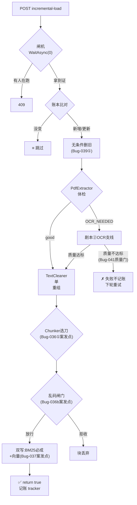
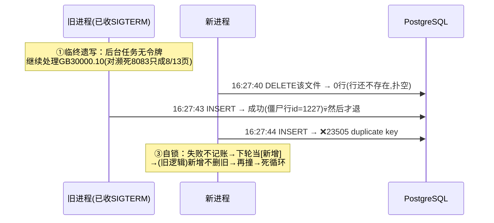

# Bug 拆解学习手册 v2：剧本式走链（2026-07-30）

> **v2 重写说明**：v1 的问题是"只讲病灶、缺正常运行逻辑作参照"。v2 改为**剧本式**——每条链路从"用户在什么情况下输入了什么"开始，一跳一跳走真实函数（带文件行号），**每一跳把所有分支情况枚举完整**，Bug 只是其中某个分支的"特例框"。先懂理想态，再看特例，最后你可以拿着附录的"日志行↔代码行"映射表亲自去日志里逐行排查。

## 怎么读本手册

每一跳的固定格式：

```
▶ 第N跳：函数名（文件#行号）
   输入：上一跳给它什么
   做什么：一句话
   分支表：所有可能的情况（正常的、降级的、失败的，全部列出）
   🐛 Bug特例框：只有当某个分支曾出过事，才出现这个框
```

六个剧本对应六个真实场景：

| 剧本 | 触发场景 | 涉及 Bug |
|------|---------|---------|
| ① 增量入库主线 | 管理员点"增量更新"按钮 | 038/039/036/037 |
| ② 扫描件 OCR 支线 | 剧本①中遇到无文本层的 PDF | 040/041/036 |
| ③ 用户提问检索 | 用户在聊天框问"苯的储存要求" | 042/043 |
| ④ 停机与并发时序 | 运维 pkill 重启 API | 038/039 |
| ⑤ 系统启动 | dotnet run 启动瞬间 | 035 |
| ⑥ 远程回归测试 | git push 后跑 dotnet test | 044/045 |

---

# 剧本① 增量入库主线：管理员点了"增量更新"

## 起点：谁、在什么情况下、输入了什么

**场景**：管理员往远程 `knowledgebase/化工专业条例/` 目录新放了一份《危险化学品重大危险源辨识》PDF，然后在前端知识库页面点"增量更新"按钮（或 curl 发 `POST /api/knowledgebase/incremental-load`，需 auditor 以上角色的 JWT）。

**输入物**：这个请求没有 body——它只是一声"开工令"。真正的输入是**文件系统里那些文件**。

## ▶ 第1跳：`KnowledgeBaseController.IncrementalLoad`（[KnowledgeBaseController.cs#L140-L162](file:///d:/桌面/agent/项目/Agent1/Agent1.Api/Controllers/KnowledgeBaseController.cs)）

HTTP 世界与业务世界的边界。真实代码：

```csharp
[HttpPost("incremental-load")]
[Authorize(Policy = "Auditor")]                       // 门卫：viewer 角色到不了这里(403)
public async Task<IActionResult> IncrementalLoad()
{
    // [Bug-039 FIX ②] 绑定停机信号：SIGTERM 后增量在文件边界安全收手
    var lifetime = HttpContext.RequestServices.GetService<IHostApplicationLifetime>();
    var stopToken = lifetime?.ApplicationStopping ?? HttpContext.RequestAborted;

    var docCountBefore = _knowledgeBase.GetDocumentCount();
    await _chemicalRAG.LoadKnowledgeBaseIncrementalAsync(stopToken);   // ← 进入第2跳
    var docCountAfter = _knowledgeBase.GetDocumentCount();
    return Ok(new { documentCountBefore = ..., documentCountAfter = ... });
```

**做什么**：领一张"停机令牌"（`ApplicationStopping`——进程收到 SIGTERM 时它会自动变红），揣着令牌调用业务层。

**分支表（这个请求可能的所有结局）**：

| 情况 | 条件 | HTTP 结果 |
|------|------|----------|
| A 正常完成 | 一路顺利 | 200 + 前后文档数 |
| B 没权限 | token 是 viewer / 无 token | 403 / 401（进不了方法体） |
| C 已有增量在跑 | 第2跳闸机拒绝 | 409 "已有任务运行中"（catch `IncrementalAlreadyRunningException`，L167-173） |
| D 中途异常 | 业务层抛其他异常 | 500 |

> 🐛 **Bug-039 视角**：修复前这里没有第 5-6 行——业务层拿不到停机令牌，SIGTERM 后后台任务对停机浑然不知（剧本④详述）。分支 C 也是修复后才存在的。

## ▶ 第2跳：`ChemicalRAG.LoadKnowledgeBaseIncrementalAsync`（[ChemicalRAG.cs#L210-L226](file:///d:/桌面/agent/项目/Agent1/Agent1/Services/Dialog/ChemicalRAG.cs)）

一道**闸机**，只干一件事：保证全进程同一时刻只有一个增量任务。

```csharp
private static readonly SemaphoreSlim _incrementalGate = new SemaphoreSlim(1, 1);  // 只有1张通行证

public async Task LoadKnowledgeBaseIncrementalAsync(CancellationToken cancellationToken = default)
{
    if (!await _incrementalGate.WaitAsync(0, cancellationToken))   // 0 = 一毫秒都不等
        throw new IncrementalAlreadyRunningException();
    try     { await LoadKnowledgeBaseIncrementalCoreAsync(cancellationToken); }   // ← 第3跳
    finally { _incrementalGate.Release(); }                        // 无论成败必还证
}
```

**分支表**：

| 情况 | 条件 | 去向 |
|------|------|------|
| A 拿到通行证 | 当前没人在跑 | 进 Core（第3跳），跑完 finally 还证 |
| B 拿不到 | 已有增量在跑 | 立即抛异常 → 第1跳的分支 C（409） |

**为什么 `WaitAsync(0)` 不排队**？第二个请求排队的结果是"第一个跑完后紧接着再扫一遍全目录"——毫无意义。立即 409 让调用方知道"在跑了，稍后看结果"。409 语义不是新发明，对齐的是血谱静脉 5 里 `Dashboard/scan` 已有的"已在跑?409:202"范式。

> 🐛 **Bug-038 特例框**：修复前**这一跳整个不存在**——两个增量请求会同时进入 Core，对同一批文件并发执行"先删后插"，DELETE/INSERT 交错撞 `source_path UNIQUE`。当时的应急是 pkill + 单任务重跑（无代码），代码层修复就是这道闸机。

## ▶ 第3跳：`LoadKnowledgeBaseIncrementalCoreAsync`（L230-L318）——增量的"大脑"

**输入**：停机令牌。**做什么**：读账本 → 扫目录 → 逐文件决定"跳过/更新/新增/删除"。

先读账本：`LoadFileTracker()` 把 `file_tracker.json`（文件绝对路径 → 上次处理时间 LastWriteTimeUtc）载入内存。然后对每个扫到的文件走这段核心循环（L244-L272）：

```csharp
foreach (var file in files)
{
    // [Bug-039 FIX ②] 停机信号到达时在文件边界安全收手，不把手头文件跑完
    if (cancellationToken.IsCancellationRequested) { ...break; }

    if (isTracked && lastWrite <= tracked)
    {
        skippedFiles++;
        continue;                                    // 分支A：没变过，跳过
    }

    // [Bug-039 FIX ①] 无条件防御性删除：DB 是否有残留不能由内存 tracker 推断
    await RemoveFileFromKnowledgeBaseAsync(file);    // 先删旧（删空了也无害）

    Console.WriteLine($"   {(isTracked ? "[更新]" : "[新增]")} {Path.GetFileName(file)}");
    if (await processor(file))                       // ← 第4跳，返回 true/false
    {
        _fileTracker![file] = lastWrite;             // 成功才记账
        if (isTracked) updatedFiles++; else newFiles++;
    }
    else
    {
        failedIncrFiles++;                           // 失败不记账 → 下轮自动重试
    }
}
```

**单个文件的分支表（全部 5 种命运）**：

| 命运 | 判定条件 | 结果 | 日志标记 |
|------|---------|------|---------|
| A 跳过 | 账本有记录 且 文件没改过 | 什么都不做 | `≡` |
| B 更新 | 账本有记录 但 文件变新了 | 删旧→重处理→改账 | `[更新]` `~` |
| C 新增 | 账本无记录 | （也先删一次，幂等）→处理→记账 | `[新增]` `+` |
| D 失败 | 处理器返回 false | **不记账**，下轮重试 | `✗` |
| E 删除 | 账本有记录但文件已不存在（L303-315 单独扫描） | 删 DB 行 + 删账 | `[删除]` `-` |

跑完打总结（L318）——**这行日志是你排查增量问题的第一入口**：

```
增量结果: +2 新增, ~1 更新, ≡52 跳过, ✗1 失败, -0 删除
```

> 🐛 **Bug-039 层①特例框**：修复前"无条件删除"那行外面套着 `if (isTracked)`——逻辑是"账本说没处理过，就不用删旧的"。错误假设：**账本（内存）和仓库（DB）永远一致**。僵尸行（剧本④）恰恰是"账本没记、仓库有货"——命运 C 的文件不删旧 → INSERT 撞 UNIQUE → 命运 D → 死循环。修复=去掉 if。副产品是删空时会打 `[DBG] DELETE 0 行(无旧记录)`（L490），让"扑空"可见。
>
> 🐛 **Bug-044 伏笔**：命运 C 现在也会触发一次"空删"——测试桩把它计入了累积列表，触发测试侧误报（剧本⑥）。

## ▶ 第4跳：`ProcessSingleFileAsync`（L499-L513）——按扩展名分派

```csharp
switch (Path.GetExtension(filePath).ToLowerInvariant())
{
    case ".pdf":               return await ProcessPdfFileAsync(...);   // ← 第5跳
    case ".doc": case ".docx": return await ProcessDocFileAsync(...);
    case ".txt":               return await ProcessTxtFileAsync(...);
    default:                   return false;                            // 不认识的格式=失败
}
```

四个分支，殊途同归：不管哪种格式，后面都走同一条"清洗→切块→入库"管线（这就是注释说的"任何入口进来的文件都走同一条链路"——全量加载 `LoadKnowledgeBaseAsync` 和增量共用，保证口径一致）。我们跟 PDF 走。

## ▶ 第5跳：`ProcessPdfFileAsync` 前半段：提取与体检（L664-L672）

```csharp
var pdfResult = _pdfExtractor.Extract(filePath);              // 抽取 PDF 自带文本层
// [OCR] 扫描件回退：文本层过薄时用视觉模型逐页转写替换薄文本
if (_pdfOcr != null && pdfResult.ExtractionMethod == "OCR_NEEDED")
{
    ... // → 剧本②
}
```

`PdfExtractor.Extract` 抽完文本层后自我体检 `EvaluateQuality`（[PdfExtractor.cs#L191-L224](file:///d:/桌面/agent/项目/Agent1/Agent1/Services/Knowledge/PdfExtractor.cs)），**三条规则全枚举**：

| 规则 | 条件 | 判定 | 含义 |
|------|------|------|------|
| 1 | 全文为空 | `OCR_NEEDED` + failed | 纯扫描件，一个字都抽不出 |
| 2 | 中文占比 < 20% | `OCR_NEEDED` + partial | 抽出来的多半是乱码/符号 |
| 3 | 平均每页中文 < 50 字 | `OCR_NEEDED` + partial | 典型病理：扫描件只有封面有文本层 |
| — | 都通过 | `good` | 文字版 PDF，直接往下走 |

**分支表**：

| 情况 | 去向 |
|------|------|
| A 文字版（good） | 跳过 OCR，直接到第6跳 |
| B 扫描件（OCR_NEEDED）且 OCR 服务已配置 | 进剧本②，OCR 成功后带着全文回来继续第6跳 |
| C 扫描件 但 OCR 未配置（`_pdfOcr == null`） | 带着薄文本硬着头皮往下走（质量 partial） |

## ▶ 第6跳：`TextCleaner.Clean`（[TextCleaner.cs#L62-L153](file:///d:/桌面/agent/项目/Agent1/Agent1/Services/Knowledge/TextCleaner.cs)）——洗菜

**输入**：全文原始字符串（可能来自文本层，也可能来自 OCR）。**做什么**：逐行过滤噪音，重组干净全文。

```csharp
var lines = rawText.Split('\n').Select(l => l.Trim())...   // 按行拆开
    // 逐行判定：封面噪声(发布单位/日期/ICS编号)剔除、全角转半角规范化...
result.CleanText = string.Join("\n", cleaned);              // ← L145 命运之行：用单个 \n 重组
result.ChineseRatio = CalculateChineseRatio(result.CleanText);
result.IsGarbled = result.ChineseRatio < 0.2;               // 整体质量自检
```

**分支表**：

| 情况 | 条件 | 结果 |
|------|------|------|
| A 正常 | 中文占比 ≥ 20% | CleanText + IsGarbled=false |
| B 疑似乱码 | 中文占比 < 20% | IsGarbled=true（后续入库质量标 partial，L741） |
| C 空输入 | 全空白 | 空文本 + IsGarbled=true |

> ⚠️ **W25 隐式契约诞生地**：L145 的 `string.Join("\n", ...)` 决定了——**TextCleaner 的产物里物理上不存在 `\n\n`（空行）**。这本身不是 Bug，是它的正常行为。但它构成一份没人签字的合同："下游切分器不得依赖空行"。谁违反谁遭殃（下一跳）。

## ▶ 第7跳：`SemanticChunker.Chunk`（[SemanticChunker.cs#L61-L70](file:///d:/桌面/agent/项目/Agent1/Agent1/Services/Knowledge/SemanticChunker.cs)）——切菜（选刀）

**输入**：干净全文 + 文档类型（来自文件所在目录名，如"化工专业条例"）。**做什么**：按类型选切法，2 万字切成几十个语义块。

```csharp
return regulationType switch
{
    "国标"       => ChunkByClause(cleanText, ...),     // 刀1：认 "4.1.2" 式条款号
    "化工专业条例" => ChunkByClause(cleanText, ...),     // ← Bug-036 修复新增的分支
    "园区规则"    => ChunkByArticle(cleanText, ...),    // 刀2：认 "第X条"
    "历史案例"    => ChunkByParagraph(cleanText, ...),  // 刀3：认空行 \n\n
    _            => ChunkByParagraph(cleanText, ...)   // 默认也是刀3
};
```

**三把刀的正常工作方式**：

**刀1 `ChunkByClause`**（L77-L102）：逐行扫描，用正则认标题行——`^(\d+(\.\d+)*)\s+ | 第X章 | 附录A`，且要求行长 <100（标题行通常短）。遇到新条款号 = 上一块结束、新块开始。每块自带 `4.1.2` 条款号元数据。**这是最懂法规结构的刀**。

**刀3 `ChunkByParagraph`**：按 `\n\n` 空行分段，段落太长时进 while 强切兜底（L253-L278）：

```csharp
while (para.Length > MaxChunkSize)
{
    int cut = MaxChunkSize;
    int boundary = para.LastIndexOfAny(new[] { '\n', '。', '；' }, MaxChunkSize - 1);
    if (boundary >= MaxChunkSize / 2) cut = boundary + 1;   // 断点太靠前(前一半)宁可硬切
    chunks.Add(...para.Substring(0, cut)...);
    para = para.Substring(cut).TrimStart();
}
```

**分支表**：

| 情况 | 输入特征 | 输出 |
|------|---------|------|
| A 结构化法规 + 刀1 | 有条款号 | 按条款切，每块 200-500 字带条款元数据（理想态） |
| B 普通文本 + 刀3 | 有空行 | 按段落切 |
| C 无空行长文 + 刀3 | OCR 全文（单 \n 重组） | 强切兜底：优先句末断，断点太偏就硬切 |

> 🐛 **Bug-036① 特例框（案发现场）**：修复前 `化工专业条例` 没有自己的 case → 落默认刀3。而第6跳的合同说了：产物里没有 `\n\n` → 刀3 一个切点都找不到 → **2 万字 = 1 块**。且当时刀3还没有 while 强切 → 这 1 块原样送去下一跳。修复 = 新增 case（复用现成的刀1，因为"化工专业条例"本质是 GB 标准）+ 给刀3补强切保底。
>
> **设计取舍**：为什么不改 TextCleaner 让它保留空行？——它喂**所有**文档类型，改它 = 全类型回归，爆炸半径不可控；改切分器只影响一个类型。

## ▶ 第8跳：入库循环（[ChemicalRAG.cs#L713-L742](file:///d:/桌面/agent/项目/Agent1/Agent1/Services/Dialog/ChemicalRAG.cs)）——过闸门、进仓库

**输入**：块列表。**做什么**：先插一条文档记录（双层表的父行），然后逐块过乱码闸门、写库。

```csharp
var documentId = await InsertDocumentForFileAsync(filePath, ...);   // 父行：knowledge_documents

foreach (var c in chunks)
{
    if (RejectGarbledChunk(c.Content, fileName, c.ChunkIndex)) continue;   // 闸门：拒收则跳过该块
    await _knowledgeBase.AddDocumentAsync(c.Content, new Dictionary<string, object>
    {
        ["RegulationType"] = regulationType, ["Priority"] = priority,
        ["SourceFile"] = fileName,                     // ← Bug-043 注意：这里写的是 PascalCase
        ["RegulationNumber"] = c.RegulationNumber ?? "",
        ...
    });
}
Console.WriteLine($"   ✅ [{fileName}]: {pdfResult.PageCount}页 → {chunks.Count}块 (质量:{pdfResult.Quality})");
return true;    // ← 走到这里 = 成功 = 第3跳会记账
```

**每个块的分支表**：

| 情况 | 条件 | 结果 |
|------|------|------|
| A 放行 | 通过乱码检测 | 写入 BM25 + PG（下一跳） |
| B 拒收 | GarbledTextDetector 命中规则（如同字符连续≥4） | 跳过该块，打"乱码块拒收 #chunkN"日志 |

> 🐛 **Bug-036(b) 特例框**：闸门规则①"同字符连续≥4 → 乱码"，假设来自历史真乱码（"书书书书"）。OCR 转写的目录点线"第一章…………1"撞了规则——当年那唯一的 1 块（Bug-036① 产物）就在这里被拒 → **入库 0 块**。修复不是放松规则（会削弱真乱码防线），而是在 OCR 源头归一化（剧本②）。这就是三行矛盾日志的完整解释：`OCR 20/20页成功`（剧本②正常）+ `28页→1块`（第7跳病）+ `乱码块拒收`（本跳误杀）。

## ▶ 第9跳：`HybridKnowledgeBaseService.AddDocumentAsync`（[HybridKnowledgeBaseService.cs#L36-L186](file:///d:/桌面/agent/项目/Agent1/Agent1/Services/Knowledge/HybridKnowledgeBaseService.cs)）——双写

```csharp
public async Task AddDocumentAsync(string content, Dictionary<string, object>? metadata = null)
{
    await _bm25Service.AddDocumentAsync(content, metadata);   // 写1：BM25 内存索引（必成）
    try
    {
        ... // 写2：调 8081 算 768 维向量 → 存 PG knowledge_chunks
    }
    catch (Exception ex)
    {
        Console.WriteLine($"   ⚠️ 批量向量化失败: {ex.Message}，BM25 已写入");   // L185
    }
}
```

**分支表**：

| 情况 | 条件 | 结果 |
|------|------|------|
| A 双写成功 | 8081 正常 | 该块可被 BM25 **和** 向量两路检索到（理想态） |
| B 半写 | 8081 报错（catch 兜住） | **只有 BM25 能搜到它**——检索静默降级，不阻断入库 |

> 🐛 **Bug-037 特例框**：分支 B 的批量触发。8081 的 `-ub`（物理批次）默认 512 token，而 nomic-embed 是非因果注意力模型——**整段必须一次进物理批次**，超了直接 500 拒载。Bug-036 修复后刀1产出 520~620 token 的条款块 → 反复触发分支 B → 80 块大面积无向量 → 混合检索实际只剩 BM25 一路。**"catch 打个 ⚠️ 就继续"的设计让灾难静默**——日志里有 `⚠️ 批量向量化失败`，但 return true 照常记账。修复在服务端：启动参数 `-b 2048 -ub 2048`（[start_services.sh#L68-L70](file:///d:/桌面/agent/项目/Agent1/start_services.sh#L68-L70)），2048=nomic 上下文上限，盖满即可。**遗留边界**：块超 2048 将无参数可调。

## 剧本①终点：一份文件的完整命运图



---

# 剧本② 扫描件 OCR 支线：文本层是空的怎么办

## 起点：从剧本①第5跳的分支 B 进来

**场景**：那份新放的 PDF 是扫描件——`PdfExtractor` 抽出来全是空/只有封面几个字，体检判 `OCR_NEEDED`。

## ▶ 第1跳：`PdfOcrService.ExtractTextAsync`（[PdfOcrService.cs](file:///d:/桌面/agent/项目/Agent1/Agent1/Services/Knowledge/PdfOcrService.cs)）

**做什么**：PDF 前 maxPages(=20) 页渲染成 PNG（`RenderPagesToPng`，PDFium，L173-179）→ 逐页发给 8083 视觉大模型"看图识字"→ 拼全文。逐页循环的真实代码（L100-L120）：

```csharp
var result = await sharedService!.OcrPageAsync(pageImages[i]);   // 一页图 → 8083 → 文字

if (result.Success && !IsBlankPageMarker(result.Content))
{
    fullText.AppendLine($"【第{i + 1}页】");
    fullText.AppendLine(NormalizeOcrText(result.Content.Trim()));   // ← 源头归一化(Bug-036③)
    outcome.PagesOcred++;
}
else
{
    outcome.PagesFailed++;
    // 视觉服务整体不可达时快速止损：不再逐页撞墙
    if (result.ErrorCategory == "ServiceUnavailable")
    {
        outcome.PagesFailed += pageImages.Count - i - 1;   // 剩余页全记失败
        break;
    }
}
```

**每一页的分支表（全枚举）**：

| 情况 | 条件 | 结果 |
|------|------|------|
| A 成功 | 8083 返回文字且非空白页 | 归一化后拼进全文，PagesOcred++ |
| B 空白页 | 返回"空白页标记" | 跳过，PagesFailed++ |
| C 单页失败 | 该页请求失败（超时/槽位满） | PagesFailed++，继续下一页 |
| D 服务死亡 | ErrorCategory=ServiceUnavailable | **快速止损**：剩余页全记失败，break |

**`NormalizeOcrText`（L160-L167）在分支 A 里干什么**——为剧本①第8跳的乱码闸门"预消毒"：

```csharp
text = DotLeaderRun.Replace(text, "…");     // 目录点线"……………"→单省略号
text = TableRuleRun.Replace(text, " --- "); // 表格分隔线→合法短线
text = DashRun.Replace(text, "—");          // 长横线串→单破折号
```

> 🐛 **Bug-036③ 关联**：这个函数就是"不放松闸门、在源头归一化"的落点。OCR 如实转写的"第一章…………1"在这里变成"第一章…1"，到闸门时不再触发"同字符连续≥4"规则。白名单式设计（只处理见过的三类模式）——新模式（公式、竖排表格）可能再触发误杀，属已知边界。

## 8083 服务端：正常态与那道算术题

**正常态**：llama-server 以 `-np 4` 开 4 个并行槽位，`-c` 是 4 槽**共享**的 KV Cache 总池（KV Cache = 模型"读过的前文"的显存账本，每 token 占一份）。一页扫描件图片编码后约 3000~3900 token。

> 🐛 **Bug-040 特例框（分支 C/D 的元凶）**：当时参数 `-c 8192`——池子 8192 ÷ 每页 ~3500 ≈ 2.3，**两页并发即占满，第三个请求 `failed to find a memory slot`**（→分支C）。叠加 `--cache-ram` 默认 8192MiB 囤积复用率恒 0% 的图像 prompt（每页唯一，永无复用），43 页 × ~190MB 顶格 → 服务渐进假死（→分支D）。**页成功率 8/13→4/20→全败的斜坡 = 资源耗尽指纹**（断崖才是进程崩）；`nvidia-smi` 显存干净（6.7/24GB）因为死在 llama-server 记账层不在 CUDA 层。修复参数：`-c 32768`（每槽独享 8192，单槽足纳一页）`--cache-ram 0`（漏水桶该关不该扩）。
> **🔴 遗留**：这组参数只活在远程 shell 历史，未固化进 start_services.sh——服务器重启即复发。

## ▶ 第2跳：回到 `ProcessPdfFileAsync` 的质量门（[ChemicalRAG.cs#L676-L699](file:///d:/桌面/agent/项目/Agent1/Agent1/Services/Dialog/ChemicalRAG.cs)）

OCR 结果带回来一张成绩单：`Success / PagesOcred / PagesTotal`。质量门全分支：

```csharp
if (ocr.Success)
{
    pdfResult.FullText = ocr.FullText;                    // 用 OCR 全文替换薄文本
    pdfResult.Quality = PdfOcrService.EvaluateOcrQuality(...);

    // [Bug-041 FIX] 扫描件质量门：按页成功比例分级
    double pageRatio = ocr.PagesTotal > 0 ? (double)ocr.PagesOcred / ocr.PagesTotal : 0;
    if (pdfResult.Quality == "failed" || pageRatio < 0.5)
    {
        _failedFiles++; ...
        return false;                    // 不入库、不记账 → 下轮增量自动重试
    }
}
else
{
    // [Bug-041 FIX] OCR 彻底失败：不沿用触发 OCR 的薄文本入库
    return false;
}
```

**分支表（全枚举）**：

| 情况 | 条件 | 去向 |
|------|------|------|
| A 高质量 | Success 且 pageRatio ≥ 0.5 且质量非 failed | 带 OCR 全文回剧本①第6跳（清洗→切块→入库），质量标 good/partial |
| B 质量不达标 | Success 但 pageRatio < 0.5 或质量 failed | `return false` → 剧本①第3跳的命运 D（下轮重试） |
| C 彻底失败 | !Success（服务死/0页） | 同上 `return false` |

> 🐛 **Bug-041 特例框（修复前这里长什么样）**：没有 pageRatio 检查、没有 else 分支的 return false——OCR 失败只打一行 ⚠️ 就**沿用触发 OCR 的那点封面薄文本**继续入库，最后 `return true` 记账。Bug-040 崩死期间 ~20 份扫描件就这样以"1 块残废"状态入库且**永不重试**（账本记了=永不再碰）。"没抛异常=成功"的判定语义是病根——与 Bug-035 的 `_initialized=true` 同款哲学。修复的优雅处：**零新增状态**，`return false` 借用现成的"失败→不记账→下轮重试"血管，一个字段都没加。
>
> **0.5 阈值的边界**：10 页成 4 页也整体拒绝——宁缺毋滥（半份法规比没有更危险）；代价是低质扫描件可能永远重试永远不过，已知可接受。

---

# 剧本③ 用户提问检索：一次搜索的完整旅程

## 起点：谁、在什么情况下、输入了什么

**场景 A（主线）**：用户在前端聊天框输入"苯的储存要求是什么？"→ `POST /api/compliance/query` → `ComplianceController` → `AgentDialog.ExecuteAsync` → IntentRouter 裁剪工具集 → LLM 决定调用 RAG 检索工具 → 进入下面的链路。
**场景 B（旁路）**：开发者在知识库页面用 rag-test 直接测检索 → `KnowledgeBaseController` 直达检索服务。两条路殊途同归于 `RetrieveAsync`。

## ▶ 第1跳：工具层 `ChemicalComplianceTools`（[ChemicalComplianceTools.cs#L77-L102](file:///d:/桌面/agent/项目/Agent1/Agent1/Services/Compliance/ChemicalComplianceTools.cs)）

```csharp
if (_lazyKb?.Value is HybridKnowledgeBaseService hybridKb)
{
    try { return await hybridKb.HydeRetrieveAsync(query, context, topK); }   // 优先：HyDE 增强检索
    catch (Exception ex) { ... }                                             // 异常→降级
}
return await GetCachedOrRetrieveAsync(query, regulationType: "国标", topK);  // 降级：普通检索(带工具层缓存)
```

**分支表**：

| 情况 | 条件 | 去向 |
|------|------|------|
| A HyDE 增强 | 混合服务可用 | 第1.5跳 HyDE |
| B 降级普通 | HyDE 抛异常 / 服务类型不符 | 工具层缓存 → 第2跳 |
| C 缓存命中 | 同 query 近期查过（RagCache TTL 内） | 直接返回缓存块 |

**第1.5跳 HyDE（`HydeRetrieveAsync` L1057-L1162）是"分支全枚举"的绝佳教材**——一个方法里 6 个降级出口，全部通向普通检索：

| 出口 | 条件 |
|------|------|
| ① 配置关了 | `EnableQueryExpansion=false` → 直接普通检索 |
| ② 无 LLM 引用 | 拿不到 LlmService → 降级 |
| ③ 生成失败 | LLM 生成"假设文档"抛异常 → 降级 |
| ④ 生成为空 | 假设文档空白 → 降级 |
| ⑤ 嵌入失败 | 假设文档算不出向量 → 降级 |
| ⑥ 任何其他异常 | 最外层 catch → 降级 |
| ✅ 正常 | 假设文档→向量检索 + 原始query→BM25 → **RRF 融合**（与第3跳同一套 GetDedupKey！） |

HyDE 的思想一句话：**先让 LLM 写一段"理想答案该长什么样"，拿这段话（而不是干巴巴的问题）去做向量检索**——答案和答案之间的语义距离比问题和答案更近。

## ▶ 第2跳：`HybridKnowledgeBaseService.RetrieveAsync`（L189-L214）——检索总入口

```csharp
public async Task<List<RetrievedChunk>> RetrieveAsync(string query, int topK = 5)
{
    if (!EvalMode.IsActive && _queryCache.TryGet(query, out var cachedResults))
        return cachedResults;                       // 分支A：查询缓存命中，直接返回

    MetricsCollector.RecordRagCacheMiss();
    var expandedQuery = ExpandQuery(query);         // 查询扩展（同义词等）

    switch (_kbConfig.SearchMode)                   // 配置决定走哪路
    {
        case SearchModeType.Bm25:   → Bm25RetrieveAsync    // 分支B：纯关键词
        case SearchModeType.Vector: → VectorRetrieveAsync  // 分支C：纯语义
        default(Hybrid):            → 混合检索              // 分支D：主线，第3跳
    }
```

**分支表**：A 缓存命中（评测模式下禁用缓存，保证用例独立）/ B 纯 BM25 / C 纯向量 / D 混合（生产默认，往下走）。

## ▶ 第3跳：混合检索 + RRF 融合（L751-L815）——本剧本的心脏

**正常态完整走一遍**。两路**并行**出发：

```csharp
var bm25Task = _bm25Service.RetrieveAsync(query, candidateTopK);    // 路1：关键词计分
var vectorTask = VectorRetrieveAsync(query, candidateTopK);         // 路2：问题→8081→向量→PG近邻
await Task.WhenAll(bm25Task, vectorTask);
```

- **BM25 路**：数关键词。"苯 储存"出现多的块分高。盲区：同义词（"防火间距"搜不到"安全距离"）。
- **向量路**：问题变 768 维坐标，找坐标最近的块。盲区：精确编号反而不如关键词准。

然后 RRF 融合——**不比分数（量纲不同），只看排名，两位评委投票**：

```csharp
const double rrfK = 60.0;
// Step 1: BM25 的排名先记入字典
for (int rank = 0; rank < bm25Results.Count; rank++)
{
    var key = GetDedupKey(bm25Results[rank], rank);          // "这是哪个块？"
    rrfScores[key] = (bm25Results[rank], 1.0 / (rrfK + rank + 1));
}
// Step 2: 向量路的排名累加进来
for (int rank = 0; rank < vectorResults.Count; rank++)
{
    var key = GetDedupKey(vectorResults[rank], rank);
    if (rrfScores.ContainsKey(key))                          // 两路是同一个块？
        rrfScores[key] = (chunk, existing.rrfScore + rrfScore);   // ← 融合的心脏：加法
    else
        rrfScores[key] = (vectorResults[rank], rrfScore);
}
// Step 3: 按总分排序取 topK
```

**手算一遍理想态**（假设块 X 在 BM25 排第 1、向量排第 3）：

```
BM25 贡献:  1/(60+0+1) = 0.01639
向量贡献:   1/(60+2+1) = 0.01587
块X总分:    0.03226  ← 两路都看好，分数显著高于单路块
只被BM25看好的块Y: 0.01639（无第二项）
```

**分支表（每个块的融合命运）**：

| 情况 | 条件 | 分数形态 |
|------|------|---------|
| A 双路命中 | 两路的 key 相等 | 两项之和（被优先推荐）|
| B 单路命中 | 只在一路出现 | 单项 1/(60+rank+1) |

> 🐛 **Bug-042 特例框（融合从未发生）**：机制成立的唯一前提是"同一个块两路算出**相等的 key**"。看两处真实代码：
>
> ```csharp
> // RetrievedChunk.cs L16-18 构造函数：
> Id = Guid.NewGuid().ToString();     // 每 new 一个对象随机发一个新 Id → Id 永不为空
>
> // 修复前的 GetDedupKey：
> if (Id非空) return $"id:{Id}";      // 永远走这支 → 下面的内容兜底 = 死代码
> ```
>
> 推理链：BM25 路 new 出的对象 Id=GUID_A，向量路 new 出的 Id=GUID_B → 同一个块两个 key → `ContainsKey` 恒 false → **那行加法从未执行** → 所有分数都是纯单路值。**破案铁证**：rag-test 里所有 score 都能被 1/(60+n) 精确解释（0.01639=1/61），且 Top-5 出现内容逐字相同、id 不同的重复条目。
>
> **历史纵深**：Bug-001 当年病灶就是融合代码里的 `Guid.NewGuid()`，当年"修复"把它搬进构造函数默认值——随机性藏得更深还带上"已修复"标签。**假修复比不修危险**：没人再盯它。
>
> **为什么修成 content-first 而不是"填 DB id"**：BM25 路走内存索引（手里没有 PG id）、向量路有——两路 Id 从不共享编号体系，"填 DB id"物理上不可行。**跨两路唯一天然共享的身份 = 块的内容本身**。修复后（L867-877）：内容非空 → `c:{Content.Trim()}`（全文做键，去掉旧 Substring(0,200) 防前缀碰撞）；内容空才退 Id；再兜底 rank。构造函数的随机 Id **没动**（爆炸半径控制，🟡遗留）。守卫测试强制用"带非空随机 Id"的生产真实形态——Bug-001 的旧单测手工造 `Id=null` 测了条生产不存在的路，复发零预警。

## ▶ 第4跳：结果组装与前端展示

Step 3 组装 `RetrievedChunk`（Content/Score/Metadata/RetrievalMethod="Hybrid-RRF"）返回。前端 rag-test 从 `Metadata` 里读来源和优先级展示。

> 🐛 **Bug-043 特例框**：`Metadata` 是 `Dictionary<string,object>`——什么都能装，代价是**编译器不管键名拼没拼对**。写入端（剧本①第8跳看到的）写 `["SourceFile"]`/`["Priority"]`（PascalCase），而读取端却 `TryGetValue("source")`/`("importance")`（小写）→ 两端键无交集 → 恒 miss → 恒落默认值"未知/未标注"。**数据都在 DB，是展示性丢失**。修复=新建 [MetadataKeys.cs](file:///d:/桌面/agent/项目/Agent1/Agent1/Services/Knowledge/MetadataKeys.cs) 常量类收敛唯一真源（拼错常量名编译器直接报错——把"这一个错位"升级为"这一类错位不再可能"），另带 `LegacySourceLower="source"` 别名回退兼容旧数据（过渡拐杖，旧数据淘汰后应删）。

---

# 剧本④ 停机与并发时序：pkill 那一刻系统里在发生什么

## 起点：运维在远程终端敲了 `pkill -f Agent1.Api`，随即启动新进程

**正常态（修复后）应该发生的事**：

```
pkill 发 SIGTERM → .NET 优雅停机开始 → ApplicationStopping 令牌变红
→ 正在跑的增量任务在【文件边界】检查到令牌 → 打 "⏹️ 收到停机信号" → 收手退出
→ 旧进程干净死亡 → 新进程启动 → 新增量从账本断点继续
```

**分支表（停机时增量任务的所有可能状态）**：

| 情况 | 增量任务状态 | 修复后行为 |
|------|------------|-----------|
| A 空闲 | 没有增量在跑 | 直接死，无事发生 |
| B 文件间隙 | 刚处理完一个文件 | 循环头检查令牌 → 立即收手 |
| C 文件处理中 | 正在 OCR 第 7/20 页 | **把当前文件跑完**才到循环头收手（窗口秒级，未归零） |
| D 非优雅死亡 | SIGKILL/断电 | 令牌机制无效；tracker 批末落盘 → 丢整批进度（知情技术债） |

> 🐛 **Bug-039 案发时序（修复前，三段链条缺一不可）**：



> - **①临终遗写**：无令牌（本剧本正常态第 2 步缺失）
> - **②竞态窗口**：先删后插非原子，间隙里被旧进程插队
> - **③自锁**：`if(isTracked)` 才删旧（剧本①第3跳特例框）
>
> **四层修复与三段一一对应**：层①无条件删除断③、层②令牌断①、层③闸机断重入（收编 Bug-038）、层④运维守卫（pgrep 确认退出——因架构边界规则禁止脚本管服务生命周期，落为 runbook 文档）。**定罪的关键取证**：对照组 id=1228 由同一旧进程同一时刻插入却安然无恙——同凶手不同结局 → 排除文件问题，锁死时序问题。07-30 远程实测三个并发 curl → 1×200 + 2×409，互斥铁证。

---

# 剧本⑤ 系统启动：兜底库初始化的 30 秒

## 起点：`dotnet run --project Agent1.Api`，DI 容器构建服务

**正常态**：`ChemicalDatabaseService.InitializeAsync`（血谱动脉 C，#L37-L89）：

```
打开/创建 SQLite 文件 Data/chemical_substances.db
→ 执行建表+建视图 SQL（整段 ExecuteNonQuery，多语句原生支持）
→ SELECT COUNT(*)：仅当 ==0 时执行 C# 四个 Seed 方法（35物质/21距离/20配伍/7法规版本）
→ 全部成功 → _initialized = true
```

**分支表**：

| 情况 | 条件 | 结果 |
|------|------|------|
| A 全新库 | 文件不存在/空表 | 建表+种子，初始化完成 |
| B 老库 | COUNT>0 | 跳过种子（**老库不吃新种子**——补数据需删库重建，设计如此） |
| C 初始化失败 | SQL 报错/文件权限 | `_initialized` 保持 false，**下次调用重试**+打日志 |

> 🐛 **Bug-035 特例框（修复前的分支 C 长什么样）**：两处叠加——(a) 历史代码有个 `SplitSqlStatements` 用 `Split(';')` 把大段 SQL 拆成单条执行（注释声称"SQLite 不支持批量"——**这个注释本身是错的**），视图定义里 `GROUP_CONCAT(..., '; ')` 字符串字面量内的分号被拦腰斩断 → `unrecognized token: "'"`；(b) catch 里写了 `_initialized = true` → 失败被标记为成功 → **永久静默**，兜底库空转，三级降级瀑布的 Level 1 名存实亡。修复 = **删除拆分器**（不是修补——`ExecuteNonQuery` 原生支持多语句，拆分器从第一天就是不必要的）+ catch 不再置成功标记。两条硬教训：不要手写解析器拆自己不懂的语法；写"X 不支持 Y"注释前先查文档。

**这个库存在的意义**（三级降级瀑布，血谱静脉 1）：用户问硬数据时 `Level 1 SQLite兜底库 → Level 2 PG图谱门面 → Level 3 硬编码字典 → FALLBACK话术`——化工安全系统**宁可降质量不能没答案**，且 PG 挂了核心数据仍可查。

---

# 剧本⑥ 远程回归测试：git push 之后

## 起点：代码推到远程，`dotnet test` 全量跑

**正常态**：测试引用生产代码，用桩（Stub）替换外部依赖，断言行为符合预期。红灯 = 生产回归**或**测试自身缺陷——**红灯亮起的第一决策永远是先定性是哪种**。

> 🐛 **Bug-044**：Bug-039 层①把删除改"无条件"后，新文件首轮也触发一次幂等空删（DB 无害）。测试桩用**类级共享**的累积列表记所有删除调用，T2 断言 `BeEmpty()`——它编码的是**修复前**的行为假设 → 首轮空删被计入 → 误报。修复：改 delta 比对（断言第二轮**没有新增**删除），不碰生产。关键决策：先跑 console trace 看到 `≡1 跳过` 定性生产正确——**若不定性就 revert 生产，僵尸行死循环复活**。
>
> 🐛 **Bug-045**：存储用 `DateTime.UtcNow`，测试边界用 `DateTime.Now`。.NET 的 `DateTime` 比较**只比 ticks 不管 Kind**——UTC+8 机器上边界"领先"8 小时 → 时间过滤多捞一条 → "期望1找到2"。**最危险处**：UTC 时区的 CI 机器上两者相等，恰好通过——假绿。修复：测试边界改 UtcNow 对齐存储。
>
> 两案共同证明：**远程真实环境回归不是形式主义**——两个缺陷都只在"UTC+8 + 共享夹具"的真实远程 Linux 上暴露。

---

# 附录A 日志行 ↔ 代码行速查表（你亲自排查日志时用）

| 日志里看到 | 谁打的 | 含义 |
|-----------|--------|------|
| `========== 化工知识库增量更新（全格式） ==========` | ChemicalRAG.cs#L234 | 增量 Core 开跑 |
| `[新增] xxx.pdf` / `[更新]` | #L264 | 文件进入处理（之前已执行无条件删除） |
| `🗑️ 已删除文档记录及级联分块` | #L488 | 防御性删除删到了旧行 |
| `ℹ️ [DBG] DELETE 0 行(无旧记录)` | #L490 | 防御性删除扑空（新文件的正常现象） |
| `⏹️ 收到停机信号(ApplicationStopping)` | #L249 | SIGTERM 到达，文件边界收手 |
| `增量结果: +n 新增, ~n 更新, ≡n 跳过, ✗n 失败, -n 删除` | #L318 | 增量总结（✗>0 就去上文找 ✗ 明细行） |
| `🔍 [xxx]: 文本层过薄，启动视觉 OCR` | #L674 | 进入剧本② OCR 支线 |
| `✅ OCR 完成: n/m页成功 → k字 (质量:x)` | #L681 | OCR 成绩单（n<m 说明有页失败） |
| `✗ [xxx]: OCR 质量不达标(...)，不入库，下轮增量重试` | #L688 | Bug-041 质量门拦截生效 |
| `✅ [xxx]: n页 → k块 (质量:x)` | #L742 | 单文件入库成功（**k=1 且页数多 → 警惕 Bug-036 型分块退化**） |
| `乱码块拒收 #chunkN` | GarbledTextDetector 调用点 | 闸门拒了一个块（大量出现→查是否误杀） |
| `⚠️ 批量向量化失败: ...，BM25 已写入` | HybridKnowledgeBaseService.cs#L185 | **Bug-037 型静默降级信号**（该块只剩 BM25 可搜） |
| `🧩 使用BM25+向量混合检索 (RRF融合)...` | #L751 | 检索走了混合路 |
| `✅ RRF混合检索完成 (召回: n, 候选池: m)` | #L814 | **m ≈ 两路之和且无重叠 → 警惕 Bug-042 型融合失效**；正常时 m < 两路之和 |
| `⚠️ HyDE 生成失败/不可用...降级为普通检索` | #L1087-1100 | HyDE 六个降级出口之一 |
| `failed to find a memory slot`（vision-8083.log） | llama-server | **Bug-040 型 KV 池耗尽信号** |
| `input (n/m tokens) is too large... batch size: 512`（embedding 日志） | llama-server 8081 | **Bug-037 物理批次溢出**（说明 -ub 参数丢了） |

# 附录B 六个剧本 × 11 个 Bug 定位总图

```mermaid
flowchart LR
    subgraph 剧本①② 入库
    B38["038闸机缺失"] --- B39["039临终遗写"] --- B36["036选刀/闸门"] --- B37["037向量拒载"] --- B40["040 KV耗尽"] --- B41["041质量门缺失"]
    end
    subgraph 剧本③ 检索
    B42["042融合失效"] --- B43["043键名错位"]
    end
    subgraph 剧本⑤⑥ 旁路
    B35["035拆分器"] --- B44["044断言口径"] --- B45["045时区"]
    end
```

# 附录C 建议的学习动线

1. **通读剧本①**（不看任何特例框，只走正常分支）——建立"一份文件的完整旅程"心智模型
2. **重读剧本①**，这次打开每个特例框——你会发现每个 Bug 都"长在"某个你已经认识的分支上
3. 同法过剧本②、③（③里先手算一遍 RRF 再看 Bug-042）
4. 剧本④用时序图走三遍：第一遍只盯旧进程、第二遍只盯新进程、第三遍看交错
5. 拿附录A 的映射表，去 `logs/remote-20260730-e2e/` 里找真实日志行对号入座——**这是你说的"亲自一行行排查"的入口**
6. 有任何一跳想看完整函数体，直接问："第X跳的 XXX 函数完整代码带我走一遍"
