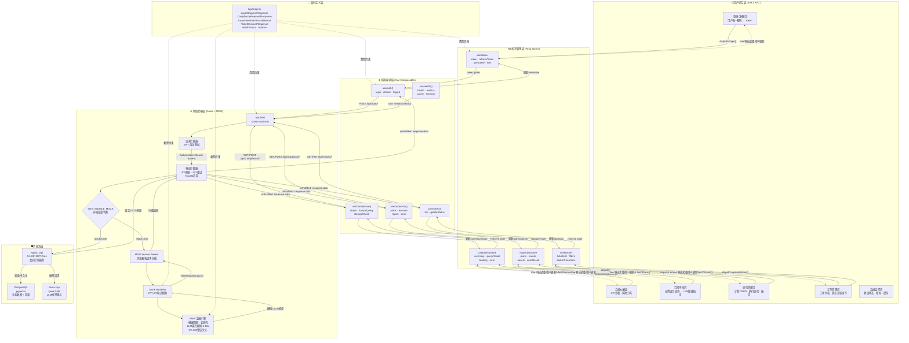

# Agent1 前端开发快速上手指南

> **目标读者**：前端开发工程师  
> **前置条件**：Node.js 18+、了解 Vue 3 Composition API  
> **文档版本**：v1.0（2026-06-25）

---

## 一、一句话概览

Agent1 前端基于 **Vue 3 + TypeScript + Element Plus + Vite 5**，通过 **MSW (Mock Service Worker)** 在浏览器端模拟全部后端 API，实现**前后端完全解耦并行开发**。

```
Mock 模式: Vue 3 → Axios → MSW (浏览器拦截) → 假数据返回 → UI 渲染
真实模式: Vue 3 → Axios → 网线 → Agent1.Api:5000 → PostgreSQL
```

> **核心价值**：写页面时不需要后端跑起来。Mock 数据格式与真实 API 完全一致，切换时**零代码改动**。

---

## 二、5 分钟跑起来

```bash
# 1. 进入前端目录
cd agent1-web

# 2. 安装依赖（仅首次）
npm install

# 3. 启动 Mock 模式开发服务器
npm run dev:mock

# 4. 浏览器打开 http://localhost:5173
#    用任意用户名+密码登录即可
```

> 看到登录页表示启动成功。Mock 模式下不验证密码，直接进入仪表盘。

---

## 三、系统交互逻辑架构



---

## 四、交互逻辑详解

### 第一步：用户触发操作

用户通过 Vue 3 SFC 组件发起操作（点击按钮、提交表单、页面加载），触发 Pinia Store 中的 action：

```
用户点击"提交合规查询"
  → CompliancePage.vue: @click="checkCompliance()"
  → complianceStore.dispatch('checkCompliance', { query: '苯和丙酮能同库吗' })
```

### 第二步：状态管理层调度

Pinia Store 的 action 调用对应的 Composable（基于 `@tanstack/vue-query`），管理请求的加载态、缓存、重试：

```
complianceStore.checkCompliance(query)
  → useComplianceCheck().mutate({ query })
  → mutationFn: (req) => apiClient.post('/api/Compliance/check', req)
```

### 第三步：网络层拦截链

请求经过 Axios 拦截器链处理：

```
apiClient.post('/api/Compliance/check', body)
  → [请求拦截器] 自动附加 JWT: Authorization: Bearer {token}
  → [MSW判断] VITE_ENABLE_MOCK === 'true' ?
```

### 第四步：模式分叉

**Mock 模式** → MSW Service Worker 在浏览器端拦截 `fetch` 请求，网线根本没有发出：

```
MSW → handlers.ts → simulateLlmDelay() 3-45s → getComplianceResponse(query)
   → 模板匹配: '苯+丙酮' → 返回预定义合规结论
   → HttpResponse.json(complianceResponse)
```

**真实模式** → 请求直连 Agent1.Api：

```
Agent1.Api → [Authorize] JWT验证 → ComplianceController.CheckCompliance()
  → 缓存查询 → LLM并发门控(SemaphoreSlim) → AgentDialog.ExecuteEvalFastAsync()
  → llama.cpp推理 → ConclusionVerifier验证 → ComplianceResponse
```

### 第五步：响应回流 → UI 更新

无论 Mock 还是真实路径，响应通过 Vue 响应式系统驱动 UI 自动更新：

```
Axios 响应 → Composable mutation onSuccess
  → complianceStore.queryResult = response.data
  → Vue 响应式追踪 → CompliancePage.vue 自动重新渲染
    → <MarkdownViewer :content="result.response" />
    → <RegulationList :items="result.verifiedRegulations" />
    → <WarningBanner :warnings="result.warnings" />
```

### 第六步：错误处理路径

| 错误码 | 处理方式 | UI 表现 |
|--------|---------|---------|
| **401** | 响应拦截器自动刷新 Token → 重放请求 | 成功则无感知；失败则跳转 `/login` |
| **503** | 响应拦截器自动重试 2 次（间隔 retryAfter 秒） | 成功则无感知；失败显示"服务繁忙" |
| **400/500** | Composable onError → 显示错误 Toast | 红色提示条 + 错误信息 |
| **网络断开** | Axios timeout 或 Network Error | "网络连接失败，请检查网络" |

---

## 五、项目文件结构

```
agent1-web/src/
├── types/api.ts              ← 🏛️ 契约层：前后端唯一真相来源，所有类型定义
├── lib/axios.ts              ← 网络层：Mock 和真实共用同一个 apiClient
├── mocks/                    ← Mock 层（仅在开发环境使用）
│   ├── handlers.ts           ← MSW 核心：27 个 API 端点模拟
│   ├── server.ts             ← MSW 启动入口
│   ├── data/
│   │   ├── compliance.ts     ← 合规审核假数据 + 模板匹配引擎
│   │   ├── inspection.ts     ← 巡检/资产假数据
│   │   └── tickets.ts        ← 工单假数据 + 状态流转引擎
│   └── README.md             ← Mock 机制详细说明
├── pages/                    ← 👈 你主要写代码的地方：Vue SFC 页面
│   ├── LoginPage.vue
│   ├── DashboardPage.vue
│   ├── compliance/
│   │   ├── ComplianceCheckPage.vue    # 合规审核（核心）
│   │   ├── HazardQueryPage.vue        # 危化品类别查询
│   │   └── StorageCheckPage.vue       # 储存兼容性检查
│   ├── inspection/
│   │   ├── InspectionPlansPage.vue    # 巡检计划管理
│   │   ├── InspectionExecutePage.vue  # 执行巡检
│   │   └── InspectionReportsPage.vue  # 巡检报告
│   ├── tickets/
│   │   └── TicketsPage.vue            # 工单管理
│   └── admin/
│       └── SystemMonitorPage.vue      # 系统监控
├── composables/              ← Vue Composables（封装 API 调用逻辑）
│   ├── useAuth.ts
│   ├── useCompliance.ts
│   ├── useInspection.ts
│   └── useTickets.ts
├── stores/                   ← Pinia 状态管理
│   ├── authStore.ts
│   ├── complianceStore.ts
│   ├── inspectionStore.ts
│   └── ticketStore.ts
└── components/               ← 可复用 UI 组件
    ├── MarkdownViewer.vue
    ├── RegulationList.vue
    └── WarningBanner.vue
```

> **标 👈 的 `pages/` 是你最常接触的目录**。组件不感知 Mock 层，专心写 UI 即可。

---

## 六、页面开发指南

### 6.1 登录页 — LoginPage.vue

| 项目 | 说明 |
|------|------|
| Mock 端点 | `POST /api/Auth/login` |
| 延迟 | 300ms |
| 请求体 | `{ username, password }` |
| 响应体 | `{ token, refreshToken, username, role, expiresAt }` |
| Mock 行为 | 任意用户名+密码即可，角色由用户名推断（含 admin→admin，含 auditor→auditor，其余→viewer） |

```typescript
// 调用示例
import { useAuth } from '@/composables/useAuth'
const { login, isPending } = useAuth()
await login({ username: 'admin', password: '123456' })
// → authStore.token 已设置，后续请求自动带 JWT
```

### 6.2 合规仪表盘 — DashboardPage.vue

| 项目 | 说明 |
|------|------|
| Mock 端点 | `GET /api/Compliance/summary` |
| 延迟 | 200ms |
| 响应体 | `ComplianceSummary` |
| Mock 数据 | `mocks/data/compliance.ts` 中的 `mockComplianceSummary` |
| 展示内容 | 总资产数、合规率、风险分布饼图、待处理工单数 |

```typescript
import { useCompliance } from '@/composables/useCompliance'
const { fetchSummary } = useCompliance()
const { data: summary } = await fetchSummary()
// summary.complianceRate → 仪表盘核心 KPI
// summary.riskDistribution → ECharts 饼图数据
```

### 6.3 合规审核页 — ComplianceCheckPage.vue ⭐ 核心

| 项目 | 说明 |
|------|------|
| Mock 端点 | `POST /api/Compliance/check` |
| 延迟 | **3-45s**（三级概率分布） |
| 请求体 | `{ query: string }` |
| 响应体 | `{ query, response, toolsUsed, verifiedRegulations, hallucinatedRegulations, warnings }` |
| Mock 行为 | 关键词模板匹配，不同查询返回不同合规结论 |

**延迟策略（基于 Task 11 实测 Qwen3-8B + RTX 3090）：**

| 概率 | 延迟范围 | 模拟场景 |
|------|---------|---------|
| 70% | 3-12s | 常规合规查询 |
| 20% | 12-25s | 复杂推理 |
| 10% | 25-45s | 巡检全量扫描 |
| 5% | 503 错误 | 并发限制触发 |

```typescript
// 使用 Vue Query mutation（推荐，自动管理 loading/error 状态）
import { useMutation } from '@tanstack/vue-query'
import apiClient from '@/lib/axios'
import type { ComplianceRequest, ComplianceResponse } from '@/types/api'

export function useComplianceCheck() {
  return useMutation({
    mutationFn: (req: ComplianceRequest) =>
      apiClient.post<ComplianceResponse>('/api/Compliance/check', req).then(r => r.data),
  })
}

// 页面中使用
const { mutate, data, isPending, error } = useComplianceCheck()
const onSubmit = () => mutate({ query: inputValue.value })
```

**测试用查询关键词（Mock 会返回不同结果）：**

| 输入关键词 | 返回结论 |
|-----------|---------|
| `苯 + 丙酮` | ⚠️ 不合规：同库储存违规，引用 GB 15603 |
| `硫酸 + 仓库` | ⚠️ 不合规：腐蚀品需专用储存区 |
| `安全距离` | 合规结论 + 安全距离计算结果 |
| 其他 | 通用合规通过结论 |

### 6.4 危化品查询 — HazardQueryPage.vue

| 项目 | 说明 |
|------|------|
| Mock 端点 | `POST /api/Compliance/hazard/query` |
| 延迟 | 3-45s |
| 请求体 | `{ substanceName: string }` |
| 响应体 | `{ substanceName, response, toolsUsed }` |
| Mock 数据 | 58 种危化品结构化属性 |

### 6.5 储存兼容性检查 — StorageCheckPage.vue

| 项目 | 说明 |
|------|------|
| Mock 端点 | `POST /api/Compliance/storage/compatibility` |
| 延迟 | 3-45s |
| 请求体 | `{ substanceA, substanceB }` |
| 响应体 | `{ substanceA, substanceB, response, toolsUsed }` |

### 6.6 巡检管理 — InspectionPlansPage.vue + Execute + Reports

| 端点 | 方法 | 延迟 | 说明 |
|------|------|------|------|
| `/api/Inspection/plans` | GET | 200ms | 计划列表 |
| `/api/Inspection/plans` | POST | 300ms | 创建计划 → `{planId, name, items:count}` |
| `/api/Inspection/plans/:id` | GET | 200ms | 计划详情 |
| `/api/Inspection/plans/:id/execute` | POST | 3-45s | 执行巡检（仅返回摘要，不含 results） |
| `/api/Inspection/rounds/:id` | GET | 200ms | 巡检轮次详情 |
| `/api/Inspection/reports/:id` | GET | 200ms | 巡检报告 |
| `/api/Inspection/reports/:id/export` | GET | 100ms | 导出报告 `{meta,plan,summary,findings,tickets,audit}` |
| `/api/Inspection/assets` | GET | 200ms | 资产台账 |
| `/api/Inspection/scan` | POST | 3-45s | 全量扫描（含 503 注入） |
| `/api/Inspection/quick-check` | POST | 1.5s | 快速检查 |

### 6.7 工单管理 — TicketsPage.vue

| 端点 | 方法 | 延迟 | 说明 |
|------|------|------|------|
| `/api/Tickets` | GET | 200ms | 工单列表 |
| `/api/Tickets/:id/status` | PUT | 300ms | 状态更新 → `{ticketId, newStatus, logCount}` |

**工单状态流转引擎（Mock 内置）：**

```
New → Confirmed → InProgress → Remediated → Verified → Closed
  ↓                                              ↓
Rejected ←────────────────────────────────────────
```

```typescript
// 更新工单状态的请求体
interface TicketStatusUpdateRequest {
  action: 'accept' | 'start' | 'complete' | 'verify' | 'close' | 'reject'
  assignee?: string
  reason?: string
}
```

**测试用Mock工单（初始化 5 条不同状态）：**

| ID | 问题 | 状态 |
|----|------|------|
| 1 | 苯与丙酮同库储存违规 | Open |
| 2 | 硫酸储存区通风不足 | Confirmed |
| 3 | 安全距离不达标（甲醇罐） | InProgress |
| 4 | 缺少 GHS 标签（氢氧化钠） | Remediated |
| 5 | 已完成整改（旧工单） | Verified |

---

## 七、Mock 数据测试技巧

### 7.1 触发 503 错误（测试错误处理）

5% 概率自动触发。如需 100% 触发测试，临时修改 `handlers.ts`：

```typescript
// handlers.ts 第 42 行
function maybeSimulateError(): ApiError | null {
  // 临时改为 100% 触发：
  // if (Math.random() < 0.05) { → if (Math.random() < 1.0) {
  if (Math.random() < 0.05) {
    return { error: '服务繁忙，请稍后重试', retryAfter: 10 };
  }
  return null;
}
```

### 7.2 调整 LLM 延迟（快速测试）

```typescript
// handlers.ts 第 31 行 — 改为固定 1s
async function simulateLlmDelay(): Promise<void> {
  await delay(1000); // 临时改为 1 秒
}
```

### 7.3 测试超长推理时间

```typescript
await delay(60000); // 60s — 测试前端的超时处理和进度条
```

### 7.4 测试登录角色

| 用户名 | 返回角色 |
|--------|---------|
| `admin` / `admin123` | `admin` — 全部功能 |
| `auditor` / `auditor01` | `auditor` — 核心业务 |
| 其他任意 | `viewer` — 只读 |

---

## 八、从 Mock 切换到真实 API

**零代码改动。** 只需要改环境变量：

```bash
# .env — 连接真实后端
VITE_API_BASE_URL=http://localhost:5000
# 不设置 VITE_ENABLE_MOCK，或设为 false
```

然后正常启动：

```bash
npm run dev
```

> Vue 组件、Composables、Stores **一行都不用改**。

---

## 九、关键设计特点

| 设计点 | 实现方式 | 价值 |
|---|---|---|
| **零代码切换** | 环境变量 `VITE_ENABLE_MOCK` 控制，业务代码不感知 | Mock ↔ 真实 API 无需改一行组件代码 |
| **类型安全** | `types/api.ts` 契约层统一约束所有层 | 编译期捕获字段不匹配 |
| **网络层透明拦截** | MSW Service Worker 在浏览器 `fetch` 层拦截 | 不侵入 Axios/Vue/Composable 任何一层 |
| **Token 自动管理** | Axios 拦截器自动附加 JWT + 401 自动刷新 | Vue 组件无需手动处理认证 |
| **LLM 延迟模拟** | `simulateLlmDelay()` 三级概率分布 + `maybeSimulateError()` 5% 503 | 前端可独立开发进度条/超时/重试逻辑 |
| **状态机驱动** | Tickets 状态流转引擎 (6 态) 在 Mock 层实现 | 不依赖后端即可测试完整工单生命周期 |
| **模板匹配** | 合规审核按关键词返回不同结论 | 开发时能看到不同输入的差异化 UI 表现 |
| **契约即文档** | `types/api.ts` 每个字段有 JSDoc 注释 | 新成员直接看类型定义即可理解接口 |

---

## 十、新增页面的开发流程

假设你要开发「知识图谱大屏」页面：

```
Step 1: 确认 API 契约
  → 在 types/api.ts 中新增 KnowledgeGraphResponse 等类型
  → 与后端确认字段名称和结构

Step 2: 添加 Mock 端点（可选，但推荐）
  → 在 handlers.ts 中新增 http.get('/api/knowledge-graph', ...)
  → 在 mocks/data/ 中创建 knowledge-graph.ts 假数据

Step 3: 写 Composable
  → composables/useKnowledgeGraph.ts
  → 用 @tanstack/vue-query 的 useQuery 封装 API 调用

Step 4: 写 Pinia Store（如需要）
  → stores/knowledgeGraphStore.ts

Step 5: 写页面
  → pages/knowledge-graph/KnowledgeGraphPage.vue
  → 直接 import Composable/Store，完全不用管 Mock/真实

Step 6: 在 Mock 模式下验证
  → npm run dev:mock → 浏览器 → 查看页面效果

Step 7: 切换到真实 API 验证
  → npm run dev → 确认端到端正常
```

---

## 十一、常见问题

### Q: 我写的 API 调用返回 404？
**A**: 检查 `handlers.ts` 中是否已注册该端点。Mock 模式下只有 handlers 中明确列出的端点才被拦截，未注册的请求会被 MSW bypass 并报 404。

### Q: Mock 数据格式和后端不一致怎么办？
**A**: 以 `types/api.ts` 为准。契约层定义了什么字段，Mock 就返回什么字段。如果发现不一致，是 Mock handler 的 bug，修改 handler 即可。

### Q: 我想跳过 MSW 直接调后端？
**A**: 设置 `VITE_ENABLE_MOCK=false` 重新 `npm run dev`。

### Q: 如何临时禁用某个 Mock 端点？
**A**: 在 `handlers.ts` 中注释掉对应的 handler 即可。

### Q: Element Plus 组件中文支持？
**A**: 已全局配置 `zh-cn` 语言包，DatePicker/Table/Form 等所有组件默认中文。

---

## 十二、技术栈速查

| 层级 | 技术 | 用途 |
|------|------|------|
| 框架 | Vue 3 (Composition API) | `<script setup lang="ts">` |
| 语言 | TypeScript 5 | 编译期类型安全 |
| 构建 | Vite 5 | 秒级 HMR |
| UI 组件 | Element Plus | Table/Form/Dialog/DatePicker 开箱即用 |
| CSS | Tailwind CSS 3 | 原子化 CSS，与 Element Plus 互补 |
| 路由 | Vue Router 4 | 嵌套路由 + 懒加载 + 角色守卫 |
| 服务端状态 | @tanstack/vue-query | LLM 长耗时请求的缓存/重试/失效 |
| 客户端状态 | Pinia | Vue 3 官方推荐状态管理 |
| HTTP | Axios | JWT 拦截器 + Token 自动刷新 |
| Mock | MSW 2 | Service Worker 拦截，框架无关 |
| 图表 | ECharts 5 + vue-echarts | 合规态势仪表盘/风险分布 |
| 表单校验 | vee-validate + zod | 声明式校验 |
| Markdown | markdown-it + highlight.js | LLM 推理结果渲染 |
| 图标 | @element-plus/icons-vue | 与 Element Plus 统一风格 |
| 测试 | Vitest + Playwright | 单元 + E2E + 视觉回归 |

---

**相关文档**：
- [Mock 机制详细说明](../../agent1-web/src/mocks/README.md)
- [API 契约定义](../../agent1-web/src/types/api.ts)
- [网络层配置](../../agent1-web/src/lib/axios.ts)
- [架构设计方案](Agent1前端架构设计方案.md)
