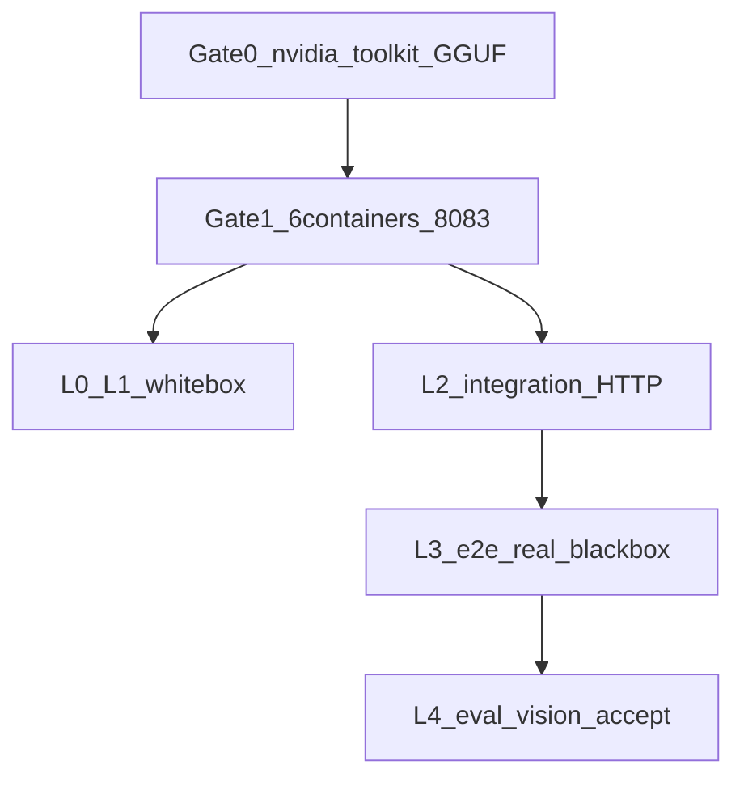

# GPU Docker 全量校验手册

> **SUT**：`docker-compose.yml`（默认 GPU，**不要**叠 `docker-compose.cpu.yml`）  
> **六容器**：postgres · llama-server :8080 · llama-embed :8081 · llama-vision :8083 · api :5000 · web（`.env` 的 `WEB_PORT`，Windows 常用 8088）  
> **对照**：CPU 冒烟见 [docker-cpu-smoke-findings.md](./docker-cpu-smoke-findings.md)（已停）；分层定义见 [测试总纲.md](../platform/测试总纲.md)。本手册 = SM-05 上机清单。  
> **有卡记录分两处，不要混写：**
> - 2026-09-05/06 **RTX 3070**：见 [实测记录](./2026-09-06_RTX3070容器实测记录.md)。**总判定失败**（8083 未通）。不要用那次「登录 200」宣称全量通过。
> - 2026-09-07 **飞致云 RTX 4090**：以 [五层两档说明](./2026-09-07_飞致云五层两档测试说明.md) 为准。`gpu-quick` 通过；`gpu-full` **未通过**（L2 缓存 0.12s）。
> 无 NVIDIA 卡的开发机不要当 GPU 验收。§9 总结果表仍是 3070 上机回填，不要改成 4090。

---

## 0. 原则

1. **分层用总纲，不另立教材项目。** L0 静态/架构 → L1 单元（白盒）→ L2 集成 → L3 Mock / Real E2E（系统/黑盒）→ L4 性能/评测。冒烟是 L2+L3 的薄切片，不是第六层。
2. **前关不过，后关不算通过。** Gate 0 机器 → Gate 1 栈冒烟 → L0/L1 白盒 → L2 集成 → L3-Real 系统 → L4 验收（评测集 + 视觉）。
3. **`benzene` 以及带「甲醇/硝酸/安全距离」的问句，亚秒返回不是 GPU 证据。** `/api/Compliance/check` 走 `ExecuteEvalFastAsync`，这些词都是 `KeywordTriggers`，会先跑工具再**跳过 llama FC**。GPU 证明问句不要带这些触发词，例如「甲类仓库与明火点最少隔开多少米」，耗时应数秒～几十秒，`toolsUsed` 含 `GetSafetyDistance`。
4. **不原样跑 AutoDL 裸机脚本。** `scripts/int-test-task11.sh`（写死 `/root/autodl-tmp`、CLI 菜单 13）和 `scripts/auto_test_v2.sh`（CLI 菜单）不是 Docker SUT。用本文 HTTP / Playwright / Eval API 等价替换。
5. **白盒不依赖 GPU，但仍列入全量清单。** GPU 机上回归一次，证明代码能编过；不能拿单元 PASS 代替 8083 / 评测。



---

## 1. 教材说法 vs 仓库五层

| 教材说法 | 仓库层 | GPU 机上怎么跑 | 算通过 |
|---|---|---|---|
| 白盒 | L0 架构 + L1 单元 | `dotnet test ArchitectureTest`；`dotnet test Agent1.Tests --filter "Category!=Integration&Category!=ApiIntegration"`；`agent1-web` `npm test -- --run` | 0 fail（带 Integration Trait 的另算 L2） |
| 冒烟 | L2 薄切 + L4 pre-deploy | 6 healthy + `/health` + 登录 + **非快路径**合规 | Gate 0–1 全过 |
| 集成 | L2 | 对外 HTTP：health / JWT / 合规 / 资产 / RAG；可选 `Category=Integration` 打 Docker Postgres | `docs>0`、真推理 `toolsUsed>0`、耗时秒级 |
| 系统 / 黑盒 | L3-Real | Playwright `e2e-real` **全量**，Nginx SPA，不起 Vite | 含 llm-quality / eval-flow / 扫描，0 fail |
| 验收 | L3 质量 + L4 评测 | `POST /api/Eval/run` 或 `scripts/post-deploy-eval.sh`；识图 `POST /api/Multimodal/analyze` | 评测 `completed`；识图 200 且 ≥3s |
| Mock 门禁 | L3-Mock | `npm run test:e2e`（MSW），不连 GPU | 可选，不挡 GPU 验收 |

**不要当 GPU 证据**

| 项 | 原因 |
|---|---|
| `Category=ApiIntegration` | `CustomApiWebApplicationFactory` + `StubLlmService`，不连 llama.cpp |
| `POST /api/Compliance/check` `{"query":"benzene"}` 亚秒返回 | SM-03 关键词快路径，几乎不走 8B |
| CPU 冒烟 11 条 Playwright（`--grep-invert "viewer|扫描"`） | 故意跳过 SM-05 |
| `npm run test:e2e`（MSW） | 假数据，测 UI 不测推理 |

CPU 冒烟已覆盖、Gate 1 **复跑确认栈没回退**：health、登录、资产 8 条、未登录 `/assets` → `/login`。  
CPU **故意 skip、本手册必须跑**：SM-05（llm-quality、eval-flow、dashboard 扫描、评测集）、视觉 8083。SM-04 viewer 可选。

---

## 2. Gate 0 — 机器（阻断，不是测试层）

在 **有 NVIDIA 卡** 的 Linux（或已装 nvidia-container-toolkit 的主机）上执行。8B + VL 同卡建议 24GB 显存（例如 3090）。

```bash
nvidia-smi --query-gpu=name,memory.total --format=csv
docker run --rm --gpus all nvidia/cuda:12.4.0-base-ubuntu22.04 nvidia-smi

# MODELS_PATH 来自 .env；下面四份都必须在
ls -lh "$MODELS_PATH"/Qwen_Qwen3-8B-Q4_K_M.gguf
ls -lh "$MODELS_PATH"/nomic-embed-text-v1.5.f16.gguf
ls -lh "$MODELS_PATH"/Qwen2.5-VL-7B-Instruct-Q4_K_M.gguf
ls -lh "$MODELS_PATH"/mmproj-Qwen2.5-VL-7B-Instruct-f16.gguf
```

`.env` 必填：`MODELS_PATH`、`KNOWLEDGE_BASE_PATH`、`DB_PASSWORD`、`JWT_KEY`。语料和 GGUF 按设计不进 Git。

启动（仓库根目录 `agent-system/`）：

```bash
bash scripts/docker-up.sh gpu
# Windows 有卡时：powershell -File scripts/docker-up.ps1 gpu
# 禁止：-f docker-compose.cpu.yml
```

| 检查 | 通过标准 | 本机结果（2026-09-05/06 3070 日志回填） |
|---|---|---|
| `nvidia-smi` | 有卡名、显存可读 | PASS（间接）：日志 `NVIDIA GeForce RTX 3070`，7097 MiB free |
| `docker run --gpus all … nvidia-smi` | 容器内也能看到 GPU | PASS（间接）：CUDA0 加载 8B 成功 |
| 四份 GGUF | 文件存在且大小合理（8B ~4.8G，VL ~5.7G，mmproj ~1.3G，embed ~0.26G） | 8B+embed 已加载；VL 在 `--mmproj` 拒参前退出，未证实 |
| compose | `gpu` 模式，无 cpu overlay | 六容器均被拉起（8GB **未 skip** vision） |

`docker run --gpus` 失败 = toolkit 没装好，后面全部不算。

---

## 3. Gate 1 — 冒烟（栈）

对应总纲 L2 薄切 + L4 pre-deploy。对应 CPU 冒烟的容器/health 步，但必须多 8083。

```bash
docker compose ps

curl -sf http://localhost:8080/health && echo LLM
curl -sf http://localhost:8081/health && echo EMBED
curl -sf http://localhost:8083/health && echo VISION
curl -sf http://localhost:5000/health
nvidia-smi
```

可选预检（**不探 8083**，8083 仍要单独 curl）：

```bash
ADMIN_PWD='你的admin密码' bash scripts/pre-deploy-check.sh
```

PowerShell 健康脚本默认打旧 SSH 隧道 `:15001`，Docker 本机必须改 URL：

```powershell
powershell -File agent1-web/scripts/health-check.ps1 -ApiUrl http://localhost:5000
```

| 检查 | 通过标准 | 本机结果（2026-09-05/06 3070 日志回填） |
|---|---|---|
| 容器 | **6/6 healthy**（含 `agent1_llama_vision`） | **FAIL**：vision 从未健康；其余第二波可用 |
| `:8080` / `:8081` / `:8083` `/health` | 均 HTTP 成功 | 8080/8081 PASS；**8083 FAIL**（`--mmproj` ×43） |
| `GET :5000/health` | `llm` = reachable，`knowledge_base_docs` > 0 | llm 可达；docs JSON 未抓到；入库成功 ×1128 |
| `nvidia-smi` | 有 llama 进程，显存占用不是 0（8B+VL 同卡通常十几 GB） | 仅 8B（模型 4455 MiB + KV 2448 MiB）；VL 未占用 |
| `health-check.ps1 -ApiUrl http://localhost:5000` | overall PASS（此步仍可能走 benzene 快路径，**不能单独当 GPU 验收**） | 未跑 |

`docs=0` 是语料没挂上（SM-02 同类），和 GPU 无关：先修 `KNOWLEDGE_BASE_PATH`。8083 不健康 = VL 文件缺失或 OOM，识图免谈。

---

## 4. L0 / L1 — 白盒

不连 GPU 也能跑；GPU 机上仍回归一次。对应总纲 §2.1 单元 + `ArchitectureTest/`。

在 `agent-system/`：

```bash
dotnet test ArchitectureTest/ArchitectureTest.csproj --no-restore
dotnet test Agent1.Tests/Agent1.Tests.csproj --filter "Category!=Integration&Category!=ApiIntegration"
```

前端：

```bash
cd agent1-web
npm test -- --run
```

可选 L3-Mock（不挡 GPU 验收）：

```bash
cd agent1-web
npm run test:e2e
```

| 套件 | 通过标准 | 本机结果（2026-09-05/06 3070） |
|---|---|---|
| `ArchitectureTest` | 0 fail | 未跑 |
| `Agent1.Tests`（排除 Integration / ApiIntegration） | 0 fail | 未跑 |
| `agent1-web` vitest `--run` | 0 fail | 未跑 |
| `npm run test:e2e`（可选） | 0 fail | 未跑 |

---

## 5. L2 — 集成（黑盒 HTTP，打正在跑的 GPU 栈）

对应总纲 §2.2 Task 11 的 Part A/B/D（环境 + API + RAG），**不要**跑 `int-test-task11.sh` 的 CLI 菜单 13。评测集放到第 7 节 L4。

先登录：

```bash
TOKEN=$(curl -s -X POST http://localhost:5000/api/Auth/login \
  -H 'Content-Type: application/json' \
  -d '{"username":"admin","password":"你的密码"}' | jq -r '.token')
```

资产与健康（CPU 冒烟已有，复跑防回退）：

```bash
curl -sf http://localhost:5000/health
curl -sf -H "Authorization: Bearer $TOKEN" http://localhost:5000/api/Inspection/assets
```

**GPU 证明问句**（不要用 benzene）。另开终端看 `nvidia-smi` 的 GPU-Util：

```bash
curl -s -X POST http://localhost:5000/api/Compliance/check \
  -H "Authorization: Bearer $TOKEN" \
  -H 'Content-Type: application/json' \
  -d '{"query":"甲类仓库与明火点最少隔开多少米"}'
```

可选：xUnit 打 Docker 映射出来的 Postgres（需本机 `DB_HOST=localhost` 等与 `.env` 一致）：

```bash
dotnet test Agent1.Tests/Agent1.Tests.csproj --filter "Category=Integration"
```

| 检查 | 通过标准 | 本机结果（2026-09-05/06 3070 日志回填） |
|---|---|---|
| `GET /health` | `knowledge_base_docs` > 0，llm reachable | llm 可达；docs JSON 未抓到 |
| 登录 | 返回 JWT | PASS：`POST /api/auth/login` 200（09-06 成功 5 次） |
| 资产 | 8 条（含苯 CAS 71-43-2 一类种子） | Nginx `/api/inspection/assets` **200**（条数未在日志展开） |
| 安全距离问句 | 耗时 **数秒～几十秒**（亚秒 = 仍走规则/缓存/关键词快路径）；`toolsUsed` 含 `GetSafetyDistance`；`verifiedRegulations` 非空；推理时 GPU-Util 跳变 | **不能判 PASS**：带「甲醇/硝酸/安全距离」会走关键词快路径（0.6s 仍会列出 `GetSafetyDistance`） |
| `Category=Integration`（可选） | 0 fail | 未跑 |

等价替换对照（总纲旧脚本 → 本文）：

| 总纲 / 旧脚本 | Docker GPU 等价 |
|---|---|
| Task 11 Part A（PG / 8080 / 8081 / API） | Gate 1 curl + `/health` |
| Task 11 Part B（登录 / 401 / 业务 API） | 本节 JWT + 合规 + 资产 |
| Task 11 Part C / T13 评测集 | 第 7 节 `POST /api/Eval/run` |
| Task 11 Part D RAG | `/health` docs>0 + L3 `knowledge-base.spec.ts` |
| `auto_test_v2.sh` CLI 菜单 | 不跑；能力由 HTTP + Playwright 覆盖 |

---

## 6. L3 — 系统 / 黑盒（Playwright Real，全量）

对应总纲 §十 `e2e-real/` 9 个 spec。打 Nginx 生产包，**不要起 Vite**（`PLAYWRIGHT_BASE_URL` 已设时 `playwright.real.config.ts` 会关掉 `webServer`）。

**不要** `npm run test:e2e:real`：其 `pretest` 会跑 `health-check.ps1` 且默认 `:15001`。直接 `npx playwright`，或 `npm run test:e2e:real:docker`（无 pretest）。飞致云一键见 [§12](#12-飞致云公司电脑一键编排)。

**不要** 像 CPU 冒烟那样 `--grep-invert "viewer|扫描"`。`gpu-quick` 可以 `--grep-invert llm-quality`（日常薄切，不能当全量）。

```bash
cd agent1-web
export PLAYWRIGHT_BASE_URL=http://localhost:8088   # Linux 若 WEB_PORT=80 则改成 http://localhost
export VITE_PROXY_TARGET=http://localhost:5000
npx playwright test --config=playwright.real.config.ts
```

PowerShell：

```powershell
cd agent1-web
$env:PLAYWRIGHT_BASE_URL = "http://localhost:8088"
$env:VITE_PROXY_TARGET  = "http://localhost:5000"
npx playwright test --config=playwright.real.config.ts
```

| Spec | 对应总纲 | 本机结果（2026-09-05/06 3070） |
|---|---|---|
| `compliance-check.spec.ts` | P1 工具链 / GB / 双通道 | 未跑（仅人工点了 `/compliance` `/chat`） |
| `inspection-flow.spec.ts` | P2 巡检 | 未跑（Nginx 点到 plans/rounds **200**） |
| `dashboard.spec.ts` | P3 **含扫描**（CPU 曾 skip） | 未跑 |
| `assets.spec.ts` | P4 资产 | 未跑 |
| `audit-log.spec.ts` | P5 哈希链 | 未跑 |
| `knowledge-base.spec.ts` | RAG 查询 | 未跑 |
| `emergency-response.spec.ts` | 应急 | 未跑 |
| `eval-flow.spec.ts` | SM-05，CPU skip | 未跑 |
| `llm-quality.spec.ts` | SM-05 七类工具选择，CPU skip | 未跑 |

通过标准：全量 **0 fail**。viewer 相关若 `.env` 无该账号会 skip（SM-04），不记失败，也不记「权限验收通过」。

---

## 7. L4 — 验收（评测集 + 视觉 + 可选性能）

对应总纲 §2.5 64 条业务评测 + Bug-034 视觉端到端。评测走 `EvalEngine` → `ExecuteEvalPerCaseAsync`（LLM 优先，不是关键词快路径）。数据：`Data/ComplianceEvalSet.json`（约 63 条有效用例）。

### 7.1 评测集

```bash
TOKEN=$(curl -s -X POST http://localhost:5000/api/Auth/login \
  -H 'Content-Type: application/json' \
  -d '{"username":"admin","password":"你的密码"}' | jq -r '.token')

TASK=$(curl -s -X POST http://localhost:5000/api/Eval/run \
  -H "Authorization: Bearer $TOKEN" | jq -r '.taskId')

# 轮询直到 completed / failed（3090 上可能 10–30 min）
curl -s -H "Authorization: Bearer $TOKEN" \
  "http://localhost:5000/api/Eval/status/$TASK"
```

或：

```bash
ADMIN_PWD='你的admin密码' bash scripts/post-deploy-eval.sh
```

不要用 `scripts/run_eval_pipeline.ps1` 对 Docker 栈裸跑 CLI（那是本机 `dotnet run --eval`）。

通过：`status=completed`。记录三项指标（对照总纲历史：工具触发 85.7% / 参数 82.5% / 结论 65.1%）。本手册 **不设死门槛**；相对历史明显退化再当告警，而不是「没到 85% 就不算栈起来」。

| 指标 | 历史参考（总纲 Task 11） | 本机结果（2026-09-05/06 3070） |
|---|---|---|
| `Total` / `casesCount` | ~63 | 未跑 `POST /api/Eval/run` |
| `ToolCallRate` | 85.7% | 未跑 |
| `ParameterAccuracy` | 82.5% | 未跑 |
| `ConclusionAccuracy` | 65.1% | 未跑 |
| `status` | completed | 未跑 |

### 7.2 视觉 / OCR（CPU 栈不起 vision）

`ENABLE_VISION_OCR` 在 GPU compose 默认为 true。上传一张 GHS 标签或储罐图（jpg/png/webp）：

```bash
curl -s -w "\nHTTP %{http_code} TIME %{time_total}\n" \
  -X POST http://localhost:5000/api/Multimodal/analyze \
  -H "Authorization: Bearer $TOKEN" \
  -F "image=@/path/to/ghs-label.jpg" \
  -F "analysisType=hazard-label"
```

| 检查 | 通过标准 | 本机结果（2026-09-05/06 3070 日志回填） |
|---|---|---|
| HTTP | **200** | **FAIL**：未打 `/api/Multimodal/analyze`；后台 OCR **×88** 全失败（8083 不可达） |
| 正文 | 真实标签/场景描述，不是空话或「错误:」 | 无成功正文 |
| 耗时 | **≥3s**（秒回 503 = 8083 不通；秒回空话 = 假成功） | 不适用 |

### 7.3 可选

- `Benchmark/`：总纲 L4 性能，不挡「推理验收」。
- SM-04：`.env` 的 `AUTH_ACCOUNTS_JSON` 补 `viewer`，重启 api，再跑 `e2e-real` 里 viewer 用例。不补只 skip，不挡 GPU 推理验收。

---

## 8. 「GPU 全量校验成功」定义

下列 **同时** 成立才算成功（对应 `gpu-full`，见 [§12 飞致云一键编排](#12-飞致云公司电脑一键编排)）：

1. Gate 0：有卡、toolkit、四份 GGUF、`docker-up.sh gpu` 已起  
2. Gate 1：6/6 healthy，8083 通，`docs>0`，显存非 0  
3. L0/L1：架构 + 单元（排除 Integration Trait）0 fail  
4. L2：安全距离问句秒级推理 + `toolsUsed` 含期望工具  
5. L3-Real：Playwright 全量 0 fail（含 llm-quality / eval-flow / 扫描）  
6. L4：`/api/Eval/run` → `completed`；识图 200 且 ≥3s；63 条指标对照 [测试总纲 §4.2](../platform/测试总纲.md) 历史基线（退化写入 `alerts[]`，**不**因未达理想 90%/85% 否决栈）  

任一层 FAIL 则整次校验失败；白盒 PASS 不能抵消 8083 或评测失败。

**两档通过口径（避免一次要测「所有功能」）：**

| 档 | 脚本 | 算通过 | 不能写什么 |
|---|---|---|---|
| **gpu-quick**（日常，约 15–25min） | Gate1 + L2 非快路径问句（如「甲类仓库与明火点最少隔开多少米」）+ Playwright **去掉** `llm-quality` | 薄切健康 | **不能**对外写「GPU 全量通过」 |
| **gpu-full**（要纲全量，约 1h） | 上表 1–6 + 识图 + 日志 D1–D6 | 手册本节 | 手点九个页面不是验收路径 |

`gpu-quick` ≠ `gpu-full`。手点页面不是验收路径。

---

## 9. 总结果表（上机填写）

| 项 | 填写（2026-09-05/06 日志回填，详见 [实测记录](./2026-09-06_RTX3070容器实测记录.md)） |
|---|---|
| 日期 | 2026-09-05 第一/二波；2026-09-06 走查。日志抓取目录 `容器日志_20260906` |
| 主机 / GPU | Windows + Docker Desktop · **RTX 3070 8GB**（非 3090） |
| `nvidia-smi` 卡名与显存 | 日志：`NVIDIA GeForce RTX 3070`，加载时 7097 MiB free |
| `MODELS_PATH` / `KNOWLEDGE_BASE_PATH` | 离线包 `cpu/models` + `cpu/knowledgebase`（路径未写入本目录） |
| `WEB_PORT` | **8088**（Nginx 访问日志） |
| Gate 0 | 有卡 PASS；VL 文件未证实 |
| Gate 1 容器 | **FAIL**：不是 6/6；vision 反复重启 |
| Gate 1 `docs` | JSON 未抓到；入库成功 ×1128；09-06 增量 21→21 |
| L0 ArchitectureTest | 未跑 |
| L1 后端单元 | 未跑 |
| L1 前端 vitest | 未跑 |
| L2 安全距离问句 耗时 / toolsUsed | 不能按手册判 PASS；06:13 五连问 1–5ms / 工具=0 |
| L3-Real Playwright | 未跑（人工走查 Nginx 95 次：93×200、1×401、1×499） |
| L4 Eval Total / 三率 | 未跑 |
| L4 识图 HTTP / 耗时 | **FAIL**（OCR ×88，8083 未听端口） |
| **总判定** | **失败** |

---

## 10. CPU 冒烟 vs GPU 全量

| | CPU 冒烟（2026-09-04） | 本手册 GPU |
|---|---|---|
| Compose | `docker-compose.yml` + `cpu.yml` | 仅 `docker-compose.yml` |
| 容器 | 5（不起 vision） | **6**（含 `llama-vision`） |
| `ENABLE_VISION_OCR` | false | true |
| 合规证据 | benzene 快路径 ~1s | 安全距离等 **LLM 规划**，秒级 |
| Playwright | 11 条，invert 掉 viewer/扫描 | **全量 9 spec**，含扫描 |
| llm-quality / eval-flow | skip（SM-05） | **必跑** |
| 评测集 | 未跑 | `POST /api/Eval/run` |
| 8083 / 识图 | 无 | 必跑 |
| 结论 | 开发机 / 提交仓可停 | 有卡机器才算生产/评测就绪 |
| **2026-09-06 3070** | — | **失败**：8083 未通，见 [实测记录](./2026-09-06_RTX3070容器实测记录.md) |

---

## 11. 已知坑（不改代码，上机避开）

1. **`health-check.ps1` 默认 `http://localhost:15001`**（旧 SSH 隧道）。Docker 本机必须 `-ApiUrl http://localhost:5000`。
2. **`npm run test:e2e:real` 的 pretest 会跑上述脚本（含 benzene）。** Docker / 飞致云编排用 `npx playwright test --config=playwright.real.config.ts` 或 `npm run test:e2e:real:docker`（**无 pretest**），并设 `PLAYWRIGHT_BASE_URL=http://localhost:8088`。公司电脑打飞致云见 [§12](#12-飞致云公司电脑一键编排)。
3. **`EvalController` 在 API 容器内 TCP 探 `localhost:8080`。** 容器里 8080 是 API 自己，探针会假阳性「在线」。真正推理走环境变量 `LLM_ENDPOINT=http://llama-server:8080/v1`。以 `status=completed` 和报告三率为准，不要以探针成功当 llama 已通。
4. **`pre-deploy-check.sh` 不检查 8083。** 视觉必须单独 `curl :8083/health`。
5. Linux 默认 `WEB_PORT` 可能是 80，Windows 常用 8088。Playwright 的 `PLAYWRIGHT_BASE_URL` 必须和实际 Nginx 端口一致。
6. **3070 实测（2026-09-05/06）：** 第一波缺 `libllama.so` exit 127；第二波 8B 起来后 vision 仍 `invalid argument: --mmproj` ×43。8GB 卡当时仍拉起了 `llama-vision`（没有 skip）。embed `n_ubatch=512`（compose 缺 `-ub`）。主 compose 未挂 `002`/`004`–`006` → 空图谱。详情 [实测记录](./2026-09-06_RTX3070容器实测记录.md)。
7. **1–5ms 且 `工具调用=0` 的合规问句不是 GPU 证据**（与第 3 条 benzene 同类）。3070 日志 06:13 五连问即此形态。

---

## 12. 飞致云：公司电脑一键编排

> **先读操作口径**：[飞致云五层两档测试说明](./2026-09-07_飞致云五层两档测试说明.md)（`gpu-quick` 测生死，`gpu-full` 测全量，同一条脚本）。  
> 生产栈在飞致云 4090 离线包上，测试在 **公司电脑** 经 SSH 多端口隧道打过去。  
> 实例操作（开机、端口、退还）见 [Featurize4090按量实例操作手册](deploy/2026-09-07_Featurize4090按量实例操作手册.md)。  
> 分层与历史指标见 [测试总纲.md](../platform/测试总纲.md) v2.2（[蓝图](../platform/测试总纲-蓝图.html)）§4.2；日志六维见 [系统日志解读与排障实战指南](../Agent1.Tests/系统日志解读与排障实战指南.md) / [系统日志阅读与分析实战教学](../Agent1.Tests/系统日志阅读与分析实战教学.md)。  
> Real E2E 失败模式：[E2E测试关注点-蓝图.html](../e2e/E2E测试关注点-蓝图.html)。

**手点九个页面不是验收路径。** 算进自动化的页面/能力 = 且仅 = `agent1-web/e2e-real/` 的 9 个 spec。不要 `npm run test:e2e:real`（pretest 会打 `:15001` + **benzene**）。不要 `int-test-task11.sh` / AutoDL cron / `download-analysis.ps1`。

### 12.1 测试要纲摘要（对齐总纲 + 蓝图）

原则：**业务质量（结论准确率）> 集成正确性 > 代码覆盖率（参考）**。

| 层 | 测什么 | 本轮怎么跑 |
|----|--------|------------|
| **L0** 架构收敛 | 15 条命名空间/分层规则 | 公司电脑 `dotnet test ArchitectureTest` |
| **L1** 单元 | 后端 xUnit + 前端 Vitest | `dotnet test Agent1.Tests`（排除 Integration/ApiIntegration）+ `npm test -- --run` |
| **L2** 集成 | 安全距离 HTTP（非 benzene、非「甲醇/硝酸/安全距离」关键词快路径） | 编排脚本经隧道 `POST /api/Compliance/check`（问句如「甲类仓库与明火点最少隔开多少米」），耗时 ≥3s，`toolsUsed` 含 `GetSafetyDistance` |
| **L3-Real** | 9 spec：合规/巡检/看板/资产/审计/知识库/应急/评测页/llm-quality | Playwright `PLAYWRIGHT_BASE_URL=http://localhost:8088`；quick 去掉 llm-quality |
| **L3-Post** | 63 条评测 + D1–D6 | 仅 `gpu-full`：`POST /api/Eval/run` + `gpu-eval-analyze.ps1` |
| **L4 识图** | `POST /api/Multimodal/analyze` | 仅 `gpu-full`，200 且 ≥3s |
| **Gate1** | 六容器健康 | `8080/8081/8083/health`、`5000/health/live`、`8088/nginx-health` |

本轮 **不算 GPU 证据**：英文 `benzene` 快路径、`npm run test:e2e`（MSW）、`Category=ApiIntegration`、文件夹 2、应急/图谱「深度产品已交付」口径。L0/L1 白盒 FAIL 记入 summary，**不阻断** L2（与 GPU 正交），也不能拿白盒 PASS 抵消 8083。覆盖率 51%→80%、Benchmark、总纲理想结论≥90% / Top-5≥85%：**不进硬卡**。

历史已测（总纲 Task 11，对照告警不否决）：工具 **85.7%**、参数 **82.5%**、结论 **65.1%**、忠实度约 **23.9%**；RAG P@5 **50.5%**、P@10 **35.9%**、MRR **0.584**。相对历史明显退化（结论下降 >5%、幻觉上升 >10%）写入 `alerts[]`。

### 12.2 命令

飞致云栈已 `compose up`、本机已装 OpenSSH、Node、.NET、Playwright 浏览器。SSH **端口每次新租会变**，从实例页抄。

```powershell
cd "d:\桌面\agent\开源大赛提交\前后端合并代码\agent-system"
$env:E2E_ADMIN_PASSWORD = '7758521'
$env:E2E_AUDITOR_PASSWORD = '7758521'
$env:E2E_VIEWER_PASSWORD = '7758521'
# 日常（约 15–25min）— 不能对外写全量通过
.\scripts\gpu-five-layer.ps1 -SshPort 65037 -Profile gpu-quick
# 要纲全量（约 1h）
.\scripts\gpu-five-layer.ps1 -SshPort 65037 -Profile gpu-full -VisionImage "D:\path\to\ghs.jpg"
```

会弹出 **另一个 SSH 窗口**，飞致云密码打在那个窗口里，不要打在跑脚本的窗口。本机 Docker 占 8088 时脚本改绑 `18088/15000/18080/18081/18083`；不要在脚本还在探测时往原窗口回车。

隧道已手工开好时加 `-SkipTunnel`。跳过本机白盒加 `-SkipWhitebox`。

**登录 HTTP 500**（`系统内部错误`，不是 401）：Gate1 仍可能全绿。这是飞致云 API 的 `AUTH_ACCOUNTS_JSON` 被 bash/YAML 吃掉，不是 Playwright 问题。`Ctrl+C` 停编排，按 [Featurize 手册 §2.3.2](deploy/2026-09-07_Featurize4090按量实例操作手册.md) 只 recreate `api`。登录未通时脚本不再跑 L3。

**本机 Docker 已占 8088/5000/8080/8081 时：** 不要停飞致云。脚本会自动改绑 `18088/15000/18080/18081/18083`（可用 `-AltTunnelPorts` 强制）。上次 Gate1「只有 8083 FAIL」就是测到了公司电脑五容器（没有 vision），不是飞致云 4090。也可先 `docker stop agent1_web agent1_api agent1_llama agent1_llama_embed` 再跑。

产出：`eval_reports\<yyyyMMdd_HHmmss>\five-layer-summary.json`。`gpu-full` 另有 `eval.json`、`comparison.json`、`analysis.md`、`log_slices/`。看 summary 的每层 PASS/FAIL/SKIP。

进程 **exit 1** 当且仅当 Gate1 或 L2 或 L3 或（full 的 Eval 未 `completed`）或（full 缺识图/识图失败）。指标退化只在 `alerts[]`。

`gpu-full` 的 `-VisionImage` 必须是本机真实 jpg/png/webp，不要用文档里的占位路径。
