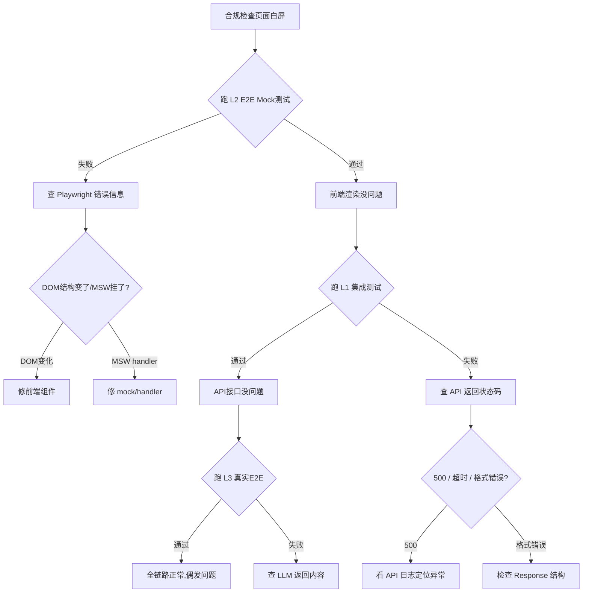
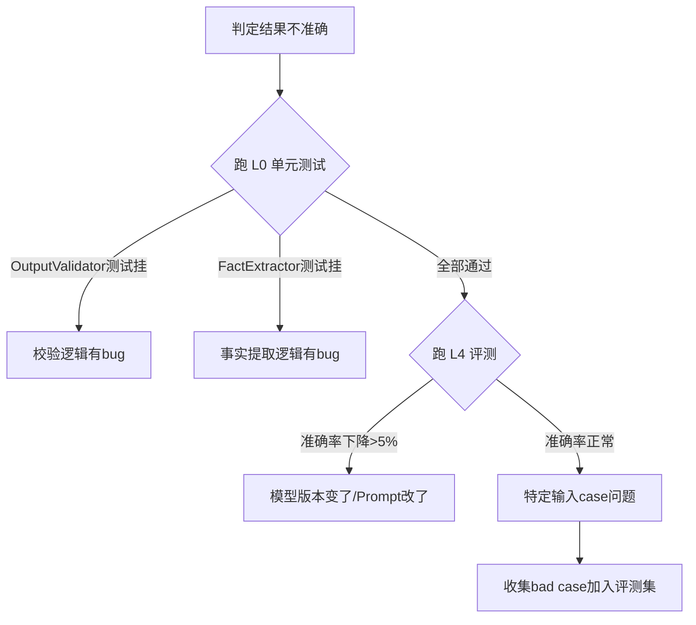

# Agent1 系统全栈掌握路线图

> **目标**：用业务路径驱动法，在3-5天内彻底掌握系统每个功能，并学会用五层测试快速定位问题。
> **背景**：切换云API降本（¥700→¥120/月）前，先确保自己能熟练使用并演示所有功能。

---

## 一、核心思路：以你为圆心，业务闭环驱动

**不要逐行读源码**（87个Service + 15个Controller + 12个Module ≈ 上万行）。

正确的打开方式：**打开前端，以admin身份登录，顺着一条完整的用户操作路径走到底，走完一个闭环再走下一个。**

每走一条路径，做三件事：

1. **亲手操作**前端页面，观察UI反馈
2. **打开浏览器DevTools → Network面板**，看请求/响应数据结构
3. **翻对应API日志 + 核心Service代码**，理解后端处理逻辑

---

## 二、五条核心业务路径（第一阶段，2-3天）

### 路径1：合规自查闭环

```
前端 /compliance
  → ComplianceController.ComplianceCheck()
    → ChemicalComplianceTools (工具调度)
      → FactExtractor (事实提取)
      → GbCodeHelper (法规编号标准化)
      → OutputValidator (编号+数值双重校验)
      → ConclusionVerifier (结论验证)
    → ComplianceAuditLogger (审计留痕)
  → Response → 前端展示合规判定 + 法规依据
```

**验证点**：输入"硝酸和丙酮共储" → AI秒出合规判定 + 引用具体法规条款号。

| 查看项 | 位置 |
|:---|:---|
| API请求体 | Network → ComplianceCheck POST |
| 核心逻辑 | `Agent1/Services/Compliance/ChemicalComplianceTools.cs` |
| 法规编号提取 | `Agent1/Services/Compliance/GbCodeHelper.cs` |
| 输出校验 | `Agent1/Services/Compliance/OutputValidator.cs` |
| 审计留痕 | `Agent1/Services/Compliance/ComplianceAuditLogger.cs` |
| Controller入口 | `Agent1.Api/Controllers/ComplianceController.cs` |
| E2E Mock测试 | `agent1-web/e2e/compliance-check.spec.ts` |
| 真实E2E测试 | `agent1-web/e2e-real/compliance-check.spec.ts` |
| 单元测试 | `Agent1.Tests/ComplianceCheckModuleTests.cs` |

---

### 路径2：应急响应闭环

```
前端 /emergency
  → EmergencyController.EmergencyResponse()
    → EmergencyResponseService (事故信息结构化)
      → FactExtractor (关键事实提取)
      → IntentRouter (意图路由)
      → ChemicalRAG (法规检索)
    → ResponseMerger (多源结果合并)
  → Response → 前端展示应急措施 + 法规引用
```

**验证点**：模拟"苯泄漏3吨" → 系统输出应急处置措施 + 相关安全法规。

| 查看项 | 位置 |
|:---|:---|
| Controller | `Agent1.Api/Controllers/EmergencyController.cs` |
| 应急服务 | `Agent1/Services/Compliance/EmergencyResponseService.cs` |
| 意图路由 | `Agent1/Services/Dialog/IntentRouter.cs` |
| 法规检索 | `Agent1/Services/Compliance/KnowledgeGraphService.cs` |
| E2E测试 | `agent1-web/e2e/emergency-response.spec.ts` |
| 单元测试 | `Agent1.Tests/EmergencyControllerTests.cs` |

---

### 路径3：知识库闭环

```
前端 /knowledge-base
  → KnowledgeBaseController
    → HybridKnowledgeBaseService (混合检索)
      → ChemicalDatabaseService (结构库查询)
      → ChemicalSubstanceDatabase (危化品库)
      → RAG/ChemicalRAG (向量检索)
      → RerankerService (结果重排序)

前端 文档管理 → 上传/删除/查询文档
  → KnowledgeBaseController
    → DocExtractor (文档解析)
    → SemanticChunker (语义分块)
```

**验证点**：搜索"硝酸" → 同时返回结构化危化品数据 + 文档片段 + 法规出处。

| 查看项 | 位置 |
|:---|:---|
| Controller | `Agent1.Api/Controllers/KnowledgeBaseController.cs` |
| 混合检索 | `Agent1/Services/Knowledge/HybridKnowledgeBaseService.cs` |
| 危化品库 | `Agent1/Services/Knowledge/ChemicalSubstanceDatabase.cs` |
| RAG | `Agent1/Services/Dialog/ChemicalRAG.cs` |
| E2E测试 | `agent1-web/e2e/knowledge-base.spec.ts` |
| 单元测试 | `Agent1.Tests/KnowledgeBaseServiceTests.cs` |

---

### 路径4：巡检计划闭环

```
前端 /inspection/plans → /inspection/plans/:id
  → InspectionController
    → InspectionOrchestrator (巡检编排)
      → ComplianceRuleEngine (合规规则引擎)
      → DeterministicRuleEngine (确定性规则兜底)
    → InspectionRepository (巡检数据持久化)
```

**验证点**：创建巡检计划 → 添加检查项 → 执行巡检 → 查看结果。

| 查看项 | 位置 |
|:---|:---|
| Controller | `Agent1.Api/Controllers/InspectionController.cs` |
| 巡检编排 | `Agent1/Services/Orchestration/InspectionOrchestrator.cs` |
| 规则引擎 | `Agent1/Services/Orchestration/DeterministicRuleEngine.cs` |
| E2E测试 | `agent1-web/e2e/inspection-flow.spec.ts` |
| 单元测试 | `Agent1.Tests/InspectionRepositoryTests.cs` |

---

### 路径5：合规评测闭环

```
前端 /eval
  → EvalController.RunEvaluation()
    → EvalEngine (64条合规评测集)
      → ComplianceCheckModule (逐条执行)
      → 结果聚合 → 生成 eval.json
  → 六阶段六维度分析报告
```

**验证点**：触发评测 → 查看各维度准确率 → 定位质量退化。

| 查看项 | 位置 |
|:---|:---|
| Controller | `Agent1.Api/Controllers/EvalController.cs` |
| 评测引擎 | `Agent1/Services/Eval/EvalEngine.cs` |
| 评测数据集 | `Data/ComplianceEvalSet.json` |
| E2E测试 | `agent1-web/e2e/eval-flow.spec.ts` |
| 单元测试 | `Agent1.Tests/EvalEngineTests.cs` |

---

## 三、五层测试金字塔与归因框架（第二阶段，1天）

### 3.1 五层定义

```
L0 ─ 单元测试 (xUnit)
│    本地运行，秒级反馈
│    覆盖：Service纯逻辑、工具函数、模型层
│    文件：Agent1.Tests/*.cs（~70+文件）
│    命令：dotnet test --filter "Category=Unit"
│
L1 ─ 集成测试 (xUnit)
│    远程GPU运行，分钟级反馈
│    覆盖：API+DB+LLM真实调用
│    文件：Agent1.Tests/*IntegrationTests.cs
│    命令：dotnet test --filter "Category=Integration"
│
L2 ─ E2E Mock测试 (Playwright + MSW)
│    本地运行，秒级反馈
│    覆盖：9个前端业务页面、权限守卫
│    文件：agent1-web/e2e/*.spec.ts（9个文件）
│    命令：npx playwright test
│
L3 ─ 真实E2E测试 (Playwright)
│    远程GPU运行，分钟级反馈
│    覆盖：完整推理链路、真实LLM响应
│    文件：agent1-web/e2e-real/*.spec.ts（9个文件）
│    命令：npx playwright test --config=e2e-real
│
L4 ─ 评测 + 日志分析
│    远程GPU运行，小时级分析
│    覆盖：64条合规评测集、模型质量监控
│    数据：eval_reports/analysis/*/eval.json
│    脚本：scripts/post-deploy-eval.sh
```

### 3.2 核心归因框架：问题按层下探

```
问题出现（前端报错/API 500/结果不对）
       ↓
┌─────────────────────────────────────────┐
│ ① 查 L2 E2E Mock 测试                    │ ← 前端DOM变了？MSW handler没匹配？
│    "跑一下对应的 e2e/*.spec.ts 看是否挂"    │    是 → 修前端代码
└─────────────────────────────────────────┘
       ↓ (L2通过，说明前端没问题)
┌─────────────────────────────────────────┐
│ ② 查 L0 单元测试                         │ ← 纯逻辑bug
│    "找到对应Service的测试，跑，看哪个挂"     │    是 → 修Service逻辑
└─────────────────────────────────────────┘
       ↓ (L0通过，说明逻辑没问题)
┌─────────────────────────────────────────┐
│ ③ 查 L1 集成测试                         │ ← API协作/DB变更
│    "跑对应Controller的集成测试"            │    是 → 修API/DB层
└─────────────────────────────────────────┘
       ↓ (L1通过，说明API没问题)
┌─────────────────────────────────────────┐
│ ④ 查 L3 真实E2E                          │ ← LLM回复格式变了
│    "跑 e2e-real 看真实推理链路"            │    是 → 修Prompt/模型配置
└─────────────────────────────────────────┘
       ↓ (L3通过，说明推理链路没问题)
┌─────────────────────────────────────────┐
│ ⑤ 查 L4 评测日志                         │ ← 模型质量渐进退化
│    "看最近一次 eval.json 准确率趋势"        │    是 → 需重新评测/调参
└─────────────────────────────────────────┘
```

### 3.3 快速定位命令速查

```bash
# L0 - 跑全部单元测试
dotnet test --project Agent1.Tests --filter "Category=Unit" -v n

# L0 - 跑单个测试类
dotnet test --project Agent1.Tests --filter "FullyQualifiedName~ComplianceCheckModuleTests"

# L1 - 跑集成测试
dotnet test --project Agent1.Tests --filter "Category=Integration"

# L2 - 跑E2E Mock测试
cd agent1-web && npx playwright test

# L2 - 跑单个E2E文件
cd agent1-web && npx playwright test e2e/compliance-check.spec.ts

# L2 - 有UI模式（调试用）
cd agent1-web && npx playwright test --ui

# L3 - 跑真实E2E
cd agent1-web && npx playwright test --config=e2e-real

# L4 - 触发评测（远程）
ssh autodl "cd /root/Agent1 && bash scripts/post-deploy-eval.sh"

# L4 - 查看最新评测报告
ls -lt eval_reports/analysis/
cat eval_reports/analysis/*/eval.json | jq .
```

---

## 四、测试错误归因实战（第三阶段，边做边学）

### 场景1：合规检查页面白屏



### 场景2：合规判定结果不准确



---

## 五、本周行动清单

### 第一步：切换云API（半天）

```bash
# 1. 注册 DeepSeek API，充值 ¥50
# 2. 修改环境变量
LLM_ENDPOINT=https://api.deepseek.com/v1
LLM_API_KEY=sk-xxxxx
EMBEDDING_ENDPOINT=https://api.deepseek.com/v1
EMBEDDING_API_KEY=sk-xxxxx

# 3. 买腾讯云轻量 VPS（2C4G, ¥68/月）
# 4. 部署 docker-compose up -d
# 5. 装 Cloudflare Tunnel → HTTPS公网地址
```

### 第二步：走通5条业务路径（2-3天）

- [ ] 合规自查：输入"硝酸和丙酮共储" → 看全链路
- [ ] 应急响应：模拟"苯泄漏3吨" → 看应急措施
- [ ] 知识库：搜索"硝酸" → 看混合检索结果
- [ ] 巡检计划：创建→执行→查看结果
- [ ] 合规评测：触发→看报告→分析退化

### 第三步：用测试排查一轮已知问题（1天）

```bash
# 先跑L2 E2E Mock，确认前端无回归
cd agent1-web && npx playwright test

# 再跑L0单元测试，确认核心逻辑无回归
dotnet test --project Agent1.Tests --filter "Category=Unit"

# 跑L4评测，确定当前模型质量基线
# （远程服务器执行）
ssh autodl "bash scripts/post-deploy-eval.sh"
```

### 第四步：制作演示素材，找种子用户

- [ ] 录制3分钟演示视频（展示合规检查核心能力）
- [ ] 准备1页产品说明（痛点→方案→效果）
- [ ] 找3-5个化工企业安环部/安评机构免费试用

---

## 六、不要做的事（避坑指南）

| ❌ 不要做 | ✅ 正确做法 |
|:---|:---|
| 逐行读全部87个Service文件 | 按业务路径走，走到哪个Service看哪个 |
| 试图把全部70+个测试跑通再开始 | 先跑L2 E2E + L0核心测试就行 |
| 花¥1500租GPU服务器 | 先用¥120/月的云API方案 |
| 等系统"完美"再上线 | 先上线，再迭代，有人用才有意义 |
| 自己闷头开发不接触用户 | 每周至少和1个潜在用户聊需求 |

---

## 附录：核心文件索引

### 前端E2E测试（9个文件）

| 测试文件 | 覆盖页面 |
|:---|:---|
| `agent1-web/e2e/dashboard.spec.ts` | 仪表盘 |
| `agent1-web/e2e/compliance-check.spec.ts` | 合规检查 |
| `agent1-web/e2e/emergency-response.spec.ts` | 应急响应 |
| `agent1-web/e2e/knowledge-base.spec.ts` | 知识库 |
| `agent1-web/e2e/inspection-flow.spec.ts` | 巡检计划 |
| `agent1-web/e2e/assets.spec.ts` | 资产台账 |
| `agent1-web/e2e/audit-log.spec.ts` | 审计日志 |
| `agent1-web/e2e/eval-flow.spec.ts` | 合规评测 |
| `agent1-web/e2e/llm-quality.spec.ts` | LLM质量 |

### 后端API入口（15个Controller）

| Controller | 路由前缀 | 负责功能 |
|:---|:---|:---|
| `AuthController.cs` | /api/auth | 登录/登出/密钥交换 |
| `ComplianceController.cs` | /api/compliance | 合规检查主入口 |
| `EmergencyController.cs` | /api/emergency | 应急响应 |
| `DashboardController.cs` | /api/dashboard | 仪表盘数据聚合 |
| `KnowledgeBaseController.cs` | /api/knowledge-base | 知识库CRUD+检索 |
| `InspectionController.cs` | /api/inspection | 巡检计划+执行 |
| `EvalController.cs` | /api/eval | 评测触发+报告 |
| `AuditController.cs` | /api/audit | 审计日志查询 |
| `TicketsController.cs` | /api/tickets | 工单管理 |
| `AdminController.cs` | /api/admin | 管理后台 |

### 关键Service（按业务分组）

**合规核心**
- `ChemicalComplianceTools.cs` — 合规工具集调度（862行）
- `OutputValidator.cs` — 输出双重校验（329行）
- `ConclusionVerifier.cs` — 结论验证（205行）
- `ComplianceAuditLogger.cs` — 审计留痕（249行）
- `FactExtractor.cs` — 事实提取（352行）

**知识库**
- `HybridKnowledgeBaseService.cs` — 混合检索（1137行）
- `ChemicalDatabaseService.cs` — 结构库查询（928行）
- `ChemicalSubstanceDatabase.cs` — 危化品库（982行）

**对话与推理**
- `AgentDialog.cs` — Agent对话编排（906行）
- `ChemicalRAG.cs` — 化工RAG实现（775行）
- `LlmService.cs` — LLM调用封装（1343行）

**评测**
- `EvalEngine.cs` — 评测引擎（1304行）
- 评测集：`Data/ComplianceEvalSet.json`
