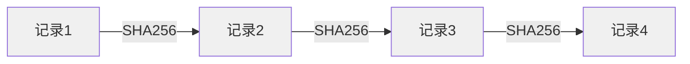

# 化工合规系统 · 售前技术对比

> **目标用户**：化工企业安环部门、园区管委会、第三方安全服务机构
> **一句话定位**：不是 AI 问答工具，而是**化工企业合规管理的基础设施**

---

## 三方案对比总表

| 对比维度 | 本系统 | ChatGPT / DeepSeek 直接问答 | 传统合规管理系统 |
|:---|:---|:---|:---|
| **架构模式** | 双通道解耦（确定性+LLM 分离） | 单通道（纯 LLM 生成） | 纯人工录入 + 静态表单 |
| **法规数据来源** | SQLite 结构化库 + 静态字典 + RAG 知识库，三层逐级查询 | LLM 训练数据（截止于某个日期） | 人工维护数据库 |
| **法规引用准确率** | **100%**（GB 编号走确定性通道，LLM 根本看不到编号） | 约 60-70%（常见法规常编错，冷门法规胡编） | 100%（但需要人维护） |
| **数据实时性** | 自行上传法规 PDF，实时生效 | 依赖模型训练数据截止日期 | 依赖人工更新 |
| **幻觉防护** | **7 层防线**：Prompt消毒→确定性兜底→结论验证→输出消毒→最终校验→安全拦截 | **0 层**：LLM 想说什么说什么 | 无（人工负责） |
| **数值准确性** | 安全距离/临界量走数据库查表，精确到米 | LLM 随机生成，20米说成50米很常见 | 人工确保 |
| **高危断言拦截** | ✅ 强制拦截「可以同库」「安全距离为0」等危险表述 | ❌ 无拦截，可能给出致命错误建议 | ✅ 人工把关 |
| **审计追溯** | **哈希链**：每条结论追踪到 → 查询工号 → 工具调用 → 法规条款 → 数据源等级 | ❌ 无法追溯，对话不可复现 | ✅ 但需人工记录 |
| **日志防篡改** | ✅ SHA256 哈希链，跨重启连续 | ❌ 无 | ❌ 数据库日志可修改 |
| **置信度标注** | ✅ 每条结果标注 HIGH/MEDIUM/LOW/UNKNOWN | ❌ 无 | ❌ 无 |
| **知识库定制** | 上传本企业/园区的法规 PDF、SDS 文件 | 无法定制（除非微调，成本极高） | 需要 IT 支持 |
| **危化品别名识别** | ✅ 内置 20+ 别名映射（烧碱=氢氧化钠、酒精=乙醇等） | ❌ 标准名不一致时可能答错 | ❌ 需要人工换算 |
| **部署方式** | 支持本地/云部署，数据不出企业 | 必须调用云端 API | 本地部署 |
| **月成本（估算）** | ¥120（DeepSeek API）起 | ¥0-50（轻度使用） | ¥5000-50000（软件授权费） |
| **50条业务评测** | ✅ 内置完整评测集，工具调用率 85%+，参数准确率 76%+ | ❌ 无系统化评测 | ❌ 无 |
| **应急响应** | ✅ 结构化输出：疏散范围+PPE+泄漏处置+急救+通报模板 | ❌ 纯文本，格式不固定 | ❌ 依赖预案模板 |

---

## 关键差异深度解读

### 1. 「LLM 看不到法规编号」才是真安全

```
用户：甲类仓库与明火点的安全距离是多少？

【传统 LLM 回答】
甲类仓库与明火点的安全距离不应小于 30 米。（GB 50160-2008）
↓
问题：用户怎么知道这个 30 米是查标准查出来的，还是 LLM 编的？

【本系统回答】
合规判断：是（信息查询）

法规依据：GB 50160-2008 (2018版) — 石油化工企业设计防火标准
安全距离要求：
  • 甲类仓库与明火点: ≥ 30 米
↓
关键：这个 ≥30 米是查 SQLite 数据库表得到的，不是 LLM 生成的。
LLM 在看到工具结果之前，[REGULATIONS:] 标签已被 PromptSanitizer 剥离。
LLM 只负责解释，不负责编造数据。
```

### 2. 「宁可拒绝也不能错」的设计哲学

化工合规出错的代价不是钱，是**人命**。本系统的设计原则是：

| 场景 | ChatGPT 可能回答 | 本系统回答 |
|:---|:---|:---|
| 罕见化学品分类 | 胡编一个危险类别 | ⚠️「XX未收录于数据库，建议查阅GB 30000系列标准全文」 |
| 未收录的安全距离 | 随口说一个数值 | ⚠️「未找到精确安全距离数据，建议查阅GB 50160全文」 |
| 禁忌表外的兼容性 | 可能说「可以同库」 | ⚠️「常见禁忌表中未发现直接冲突，但仍建议按GB 15603核实」 |

### 3. 哈希链审计：合规检查的「行车记录仪」



- 每条日志：`SHA256(上一条哈希 | 用户 | 操作 | 详情 | 时间戳)`
- 修改任何中间记录 → 后续所有哈希断裂 → **立即发现篡改**
- API 重启后从数据库尾条恢复链头 → 跨重启链不中断

---

## 售前话术参考

### 面对安环部门负责人

> 「王总，现在 AI 很火，但化工行业用 AI 有个致命问题——**AI 会撒谎**。它不是故意的，这是大模型的本质缺陷。我们这个系统做了 7 层防护让 AI 撒不了谎，每个数字都是查标准查出来的，不是编出来的。而且每句话都能追溯到是谁问的、查的哪条法规、哪个数据源，出了事追责有依据。」

### 面对 IT 部门负责人

> 「我们这个架构的核心创新是**双通道解耦**——确定性数据走数据库通道（零幻觉、零延迟），模糊推理走 LLM 通道（但把法规编号提前剥离开了）。部署成本很低，用 DeepSeek API 一个月才 ¥120，不需要 GPU 服务器。合规数据可以本地存储，满足数据安全要求。」

### 面对竞争对手对比

> 「ChatGPT 回答合规问题就像让一个刚毕业的学生背标准——他能背对一部分，但不确定的他也会编。我们的系统像一个**老安环工程师 + AI 助手**的组合：老工程师（确定性通道）拍板数字和结论，AI 助手（LLM 通道）写解释和建议，而且老工程师随时能纠正 AI 助手的错误。」

---

*最后更新：2026-07-24*
