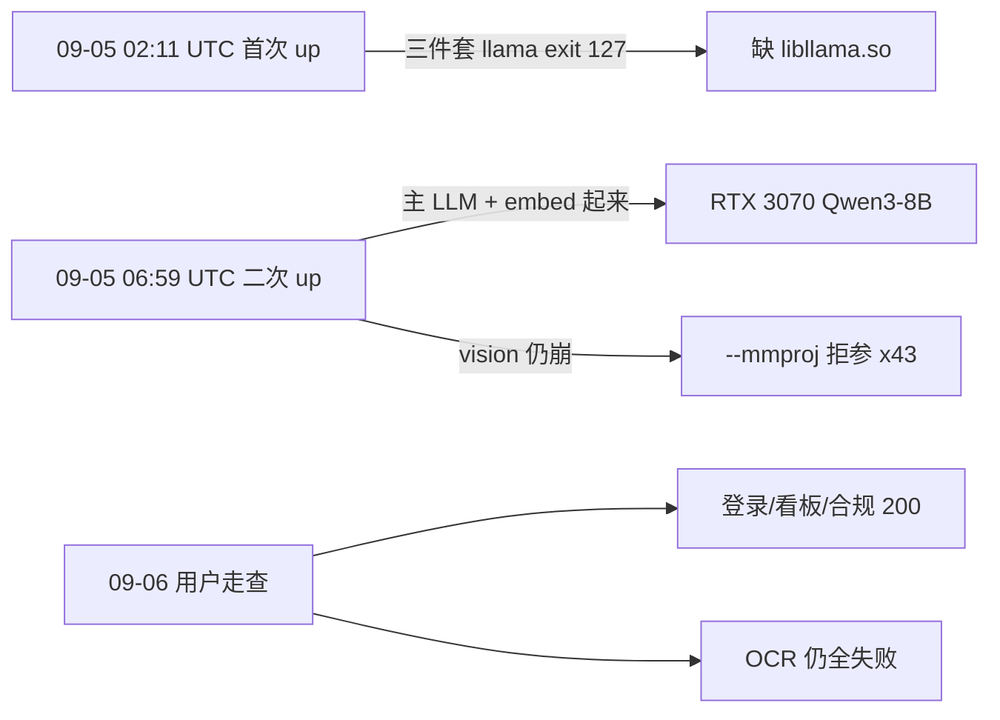

# 2026-09-06 RTX 3070 容器日志核验与文档真实性

> 对照 home-pc 的 D01–D18 台账，用 company-pc 上的原始容器日志做次数核验。不写补丁、不改业务代码。  
> 日期：2026-09-06。写于 **company-pc**。  
> 证据目录（仓库外）：`容器化部署/gpu/另一台机器测试部署启动日志/`。

home-pc 台账写「原始 zip 已从工作区消失」。那批日志现已回到 company-pc，路径见下。**本文只核 3070 容器日志能证明的句子**；3090 裸机 / company-pc 7 月取证不在本目录，标「未核」。

---

## 1. 一句话

这台 3070：**主 LLM + Web + DB 能用，完整 GPU 演示不能算过。**  
挡路的是旧 `llama-server`（vision 拒 `--mmproj`、流式 tools 被拒）+ compose 没带 `-ub` 和 `002`/`004`–`006`，不是页面改坏了。

home-pc 三份 09-06 文档对这台机是真的（次数对得上）。本机未提交文档若把「钉 b5341，`--mmproj` 已修」读成 **3070 实测结论**，不真实——那是工作区目标，尚未在这台有卡机上冒烟。

---

## 2. 证据文件

| 文件 | 用来证明什么 |
|------|----------------|
| `另一台机器测试部署启动日志/docker-up-20260905.log` | **第一波**（09-05 02:11 UTC）：`libllama.so` 缺失，exit 127 ×63 |
| `容器日志_20260906/容器日志_20260906/agent1_llama-docker.log` | 第二波主 LLM：RTX 3070、37/37 offload、`:8080`；`Cannot use tools with stream` ×240 |
| `…/agent1_llama_embed-docker.log` | embed `:8081`；启动写明 `n_ubatch = 512`；physical batch 拒收 ×179 |
| `…/agent1_llama_vision-docker.log` | `error: invalid argument: --mmproj` ×43；从未 listening |
| `…/agent1_api-docker.log` | 空图、漂移表、OCR、duplicate key、增量 21→21、登录失败、Hybrid→Bm25 |
| `…/agent1_db-docker.log` | `knowledge_documents_source_path_key` ×190 |
| `…/agent1_web-docker.log` | Nginx 95 条访问：93×200、1×401、1×499 |
| `…/api_container_logs/serilog-self.log` | Seq `localhost:5341` ×49 |
| `…/api_container_logs/agent1-20260906.log` | 09-06 结构化摘要（与 docker 日志同事件，无重复计数） |

同级根目录 `agent1_*.log` 是第二波的**截断副本**，不含 exit 127。第一波只以 `docker-up-20260905.log` 为准。

对照文档（home-pc 包，待合入 `master` 时路径如下）：

- [2026-09-06_容器化问题总览与工程结论.md](./2026-09-06_容器化问题总览与工程结论.md)
- [GPU 部署全量技术 Bug 分层台账](../数据库化石/2026-09-06_GPU部署全量技术Bug分层台账.md)
- [容器化 vs 裸机溯源](../数据库化石/2026-09-06_容器化vs裸机部署问题溯源比对.md)

若尚未 merge home-pc 文档包，上述三份在桌面 zip：`agent-system-home-pc-20260906/1-docs-ok-to-merge/files/`。

---

## 3. 两波时间线（不是「一天」）

**第一波**（本地 10:11，日志 UTC 02:11）：`llama-server: error while loading shared libraries: libllama.so: cannot open shared object file`，三个 llama 容器 `exited with code 127 (restarting)` 共 63 次。这是 Gitee `4e5b6e8`（把共享库打进 CUDA 运行镜像）要修的那一层。

**第二波**（06:59 UTC 起，积到 09-06）：共享库已能跑。主 LLM `Device 0: NVIDIA GeForce RTX 3070`、`offloaded 37/37 layers`、`listening on http://0.0.0.0:8080`、health 200。embed `listening :8081`，但 `n_ubatch = 512`。vision 认出 3070 后立刻拒 `--mmproj`，8083 从未就绪。

**09-06**：API 04:53 UTC 重启后 `用户登录成功: admin`；08:42–08:52 浏览器走查。无 OOM / NVML / SIGKILL。

结论：二次部署修了 **exit 127**，**没有**修 `--mmproj`。跑的仍是不认该参数的旧二进制（与 `4e5b6e8` 仍钉 b5092 一致），不是本机工作区里的 b5341。

---

## 4. 次数核验（home-pc 台账 vs 本目录）

下列次数与日志逐字重合，不是估的。

| 主张 | 日志命中 | 判定 |
|------|----------|------|
| `--mmproj` ×43 | vision-docker.log **43** | 真 |
| `Cannot use tools with stream` ×240 | llama-docker.log **240** | 真 |
| `increase the physical batch size` ×179 | embed-docker.log 与 api-docker.log 各 **179** | 真 |
| 启动 `n_ubatch = 512` | embed-docker.log 一行 | 真；`--batch-size 1024` 是逻辑批次 |
| API `Loading model` ×376 | api-docker.log **376** | 真 |
| `source_path` UNIQUE「约 190」 | db-docker **190** / api-docker **199** | 真 |
| Seq `localhost:5341` ×49 | serilog-self.log **49** | 真 |
| `0 物质, 0 别名, 0 禁忌边` | api-docker 启动行 | 真 |
| `drift_anchors` 不存在 | api-docker `42P01` | 真 |
| `21 → 21` / 212111ms | 09-06 05:36 UTC | 真 |
| `Hybrid → Bm25` | 09-06 05:32 UTC | 真 |
| 06:13 五连问 1–5ms、`工具调用=0` | 五条 Pipeline 完成 | 真 |
| Web 95 次、93×200 | web-docker 访问行；另 1×401、1×499 | 真 |

台账没写、但不打脸：09-05 晚还有一次增量 `1090 → 1331` / 257s。

---

## 5. D01–D18 对错（现象层）

### 5.1 挡住完整 GPU 演示

| ID | 判定 | 本目录证据 |
|----|------|------------|
| **D01** | 真 | vision 见卡即退 ×43。compose 仍传 `--mmproj`（`docker-compose.yml` llama-vision）。 |
| **D05** | 真，D01 下游 | OCR「视觉服务不可达 / Name or service not known / Connection refused」，并写「不入库、不沿用薄文本」（Bug-041 门生效）。 |
| **D02** | 真 | `n_ubatch = 512`；compose embed 有 `-c 2048 --batch-size 1024`，**没有 `-ub`**。 |
| **D03** | 真 | 主 LLM 已在跑，仍 tools+stream ×240。升到认 `--mmproj` 的 **b5341 不一定消这条**；home-pc 写约 b5478 才允许。本机文档若把 D01 与 D03 捆成「b5341 已修」，不精确。 |
| **D04 / D07** | 真 | 主 compose 只挂 `init_database.sql`，无 `002`/`004`–`006`。空图 + 漂移表不存在。 |
| **D06** | 真 | 二次扫描撞 `knowledge_documents_source_path_key`。 |
| **D08** | 真 | 09-06 `21→21 / 212.1s`。 |
| **D11** | 真 | DataProtection 写在容器可写层 `/home/appuser/.aspnet/DataProtection-Keys`。 |
| **D16** | 真 | `POST /api/compliance/check` **499**，Referer `/chat`。 |

### 5.2 操作 / 设计 / 潜伏（不是这次「改坏了页面」）

| ID | 判定 | 说明 |
|----|------|------|
| **D09** | 真 | `检索模式切换: Hybrid → Bm25`，人点的。 |
| **D10** | 真 | 06:13 五连问走快路径。 |
| **D13 / D14 / D17 / D18** | 真 | Seq 拒连、https 端口警告、OutputSanitizer 拦截 1 字符、ERP 未接入。 |
| **D15** | 真 | `登录失败: admin` 两次后成功。判密码输错合理，日志无更细原因。 |
| **D12** | 代码真、日志未炸 | `agent1-web/src/api/compliance.ts` 包装路径为连字符 `/api/compliance/storage-compatibility`；页面直打斜杠。台账「本次未走包装」成立。 |

前端路由根因 **0**：Nginx 无 JS/路由 5xx。401 是未登录打 `/api/Compliance/summary`（鉴权正确）。

---

## 6. A/B/C/D 分类：3070 侧成立，3090 侧未核

就 **3070 日志 + 当前 compose** 而言：主因在 L11/L10（镜像版本、漏 `-ub`、漏挂迁移）成立。

下列句子引用 `_tmp_3090_logs/`、`_tmp_company_pc_harvest/`，**不在本目录**，标未核（无反证，也不能用本目录背书）：

- 3090 开机 57 天、物质 35、`drift_anchors` 50
- 裸机 `--mmproj` / `tools+stream` 为 0 次
- company-pc 7 月日志视觉打 8082 共 6 条
- 更旧 Dockerfile 钉过 `b4908`

---

## 7. 本机文档哪些句子必须加限定

Gitee `origin/master` = `4e5b6e8`：只把 `.so` 打进运行镜像，**Dockerfile 仍钉 b5092**。  
本机工作区已把 `Dockerfile.llama*` 改成 **b5341**，但 **未在这台 3070 上用新镜像冒烟**。二次部署后 vision 仍拒 `--mmproj`，证明当时跑的不是 b5341。

因此：

| 说法 | 应改成 |
|------|--------|
| 「b5092 下 `--mmproj` 已修」 | 本机工作区**目标**；3070 于 2026-09-05/06 **仍拒参 ×43**。见本文。 |
| 「GPU 离线包已与 b5341 同源」 | 仅当新 tar 在有卡机上 `llama-vision` Up 且不再 `invalid argument: --mmproj` 之后。 |
| 「完整 GPU 演示可用」 | 不可。Gate 1 的 8083 / OCR 按本日志过不了。 |

已在同日改过限定语的文件：

- [CHANGELOG.md](./CHANGELOG.md)（2026-09-05 条）
- [开源项目分发落地方案.md](../deploy/开源项目分发落地方案.md) §7.4、§8.0
- [Docker容器化一键部署.md](../deploy/Docker容器化一键部署.md) 构建说明

不要把本备忘或 home-pc 文件夹 2（未测演示路径代码）推进「已验收」叙述。

---

## 8. 其它部署文档怎么读

- `容器化部署/README.md`、`gpu/README.md`、`gpu/豆包-另一台机启动与日志检查.md`：exit 127 与 `--mmproj` 拒参的预告与实测一致。豆包手册「必须先 rebuild」被第一波证实。
- 6–7 月 3090 **裸机**手册：另一时代、另一形态，不和这次 Docker 日志矛盾，也验证不了这次。
- [GPU全量校验手册.md](../testing/GPU全量校验手册.md)：结果表已按 3070 日志回填，**总判定失败**。明细 [实测记录](../testing/2026-09-06_RTX3070容器实测记录.md)。
- [docker-cpu-smoke-findings.md](../testing/docker-cpu-smoke-findings.md)：2026-09-04 CPU 栈，与本次 GPU 无关。

---

## 9. 收束

1. home-pc D01–D18 **可以当这批 3070 日志的说明书**。
2. `4e5b6e8` 只证明「缺 `.so` → 打进镜像」这条链；不证明 vision / 流式 FC。
3. 本机 b5341 改动在 3070 最小冒烟（vision Up、不再拒 `--mmproj`）之前，**不要写进会推的「已修」句子**。
