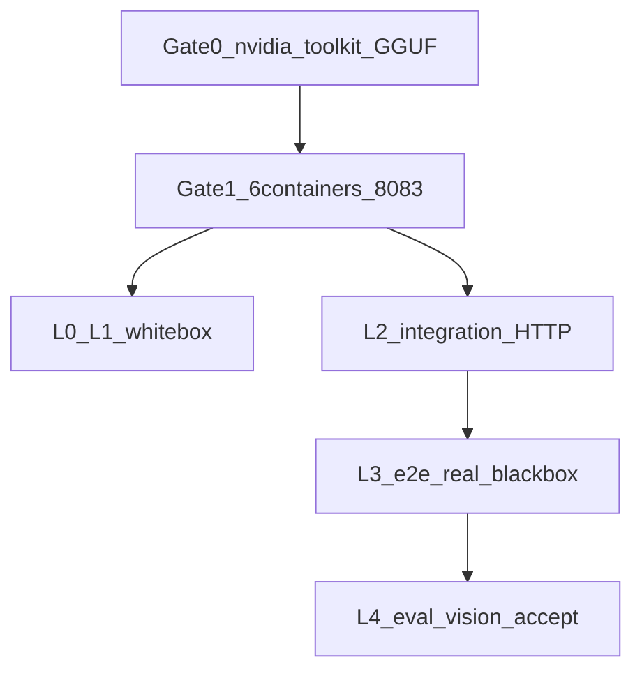

# GPU Docker 全量校验手册

> **SUT**：`docker-compose.yml`（默认 GPU，**不要**叠 `docker-compose.cpu.yml`）  
> **六容器**：postgres · llama-server :8080 · llama-embed :8081 · llama-vision :8083 · api :5000 · web（`.env` 的 `WEB_PORT`，Windows 常用 8088）  
> **对照**：CPU 冒烟见 [docker-cpu-smoke-findings.md](./docker-cpu-smoke-findings.md)（已停）；分层定义见 [测试总纲.md](./测试总纲.md)。本手册 = SM-05 上机清单。  
> **结果表**：先留空。上有卡机器跑完再填。无 NVIDIA 卡的开发机不要当 GPU 验收。

---

## 0. 原则

1. **分层用总纲，不另立教材项目。** L0 静态/架构 → L1 单元（白盒）→ L2 集成 → L3 Mock / Real E2E（系统/黑盒）→ L4 性能/评测。冒烟是 L2+L3 的薄切片，不是第六层。
2. **前关不过，后关不算通过。** Gate 0 机器 → Gate 1 栈冒烟 → L0/L1 白盒 → L2 集成 → L3-Real 系统 → L4 验收（评测集 + 视觉）。
3. **`benzene` 1 秒 `toolsUsed=1` 不是 GPU 证据。** 那是 SM-03 关键词快路径。GPU 证明问句用「甲醇储罐和硝酸储罐的安全距离是多少」一类会走 LLM 规划的路径。
4. **不原样跑 AutoDL 裸机脚本。** `scripts/int-test-task11.sh`（写死 `/root/autodl-tmp`、CLI 菜单 13）和 `scripts/auto_test_v2.sh`（CLI 菜单）不是 Docker SUT。用本文 HTTP / Playwright / Eval API 等价替换。
5. **白盒不依赖 GPU，但仍列入全量清单。** GPU 机上回归一次，证明代码能编过；不能拿单元 PASS 代替 8083 / 评测。



---

## 1. 教材说法 vs 仓库五层

| 教材说法 | 仓库层 | GPU 机上怎么跑 | 算通过 |
|---|---|---|---|
| 白盒 | L0 架构 + L1 单元 | `dotnet test ArchitectureTest`；`dotnet test Agent1.Tests --filter "Category!=Integration&Category!=ApiIntegration"`；`agent1-web` `npm test -- --run` | 0 fail（带 Integration Trait 的另算 L2） |
| 冒烟 | L2 薄切 + L4 pre-deploy | 6 healthy + `/health` + 登录 + **非快路径**合规 | Gate 0–1 全过 |
| 集成 | L2 | 对外 HTTP：health / JWT / 合规 / 资产 / RAG；可选 `Category=Integration` 打 Docker Postgres | `docs>0`、真推理 `toolsUsed>0`、耗时秒级 |
| 系统 / 黑盒 | L3-Real | Playwright `e2e-real` **全量**，Nginx SPA，不起 Vite | 含 llm-quality / eval-flow / 扫描，0 fail |
| 验收 | L3 质量 + L4 评测 | `POST /api/Eval/run` 或 `scripts/post-deploy-eval.sh`；识图 `POST /api/Multimodal/analyze` | 评测 `completed`；识图 200 且 ≥3s |
| Mock 门禁 | L3-Mock | `npm run test:e2e`（MSW），不连 GPU | 可选，不挡 GPU 验收 |

**不要当 GPU 证据**

| 项 | 原因 |
|---|---|
| `Category=ApiIntegration` | `CustomApiWebApplicationFactory` + `StubLlmService`，不连 llama.cpp |
| `POST /api/Compliance/check` `{"query":"benzene"}` 亚秒返回 | SM-03 关键词快路径，几乎不走 8B |
| CPU 冒烟 11 条 Playwright（`--grep-invert "viewer|扫描"`） | 故意跳过 SM-05 |
| `npm run test:e2e`（MSW） | 假数据，测 UI 不测推理 |

CPU 冒烟已覆盖、Gate 1 **复跑确认栈没回退**：health、登录、资产 8 条、未登录 `/assets` → `/login`。  
CPU **故意 skip、本手册必须跑**：SM-05（llm-quality、eval-flow、dashboard 扫描、评测集）、视觉 8083。SM-04 viewer 可选。

---

## 2. Gate 0 — 机器（阻断，不是测试层）

在 **有 NVIDIA 卡** 的 Linux（或已装 nvidia-container-toolkit 的主机）上执行。8B + VL 同卡建议 24GB 显存（例如 3090）。

```bash
nvidia-smi --query-gpu=name,memory.total --format=csv
docker run --rm --gpus all nvidia/cuda:12.4.0-base-ubuntu22.04 nvidia-smi

# MODELS_PATH 来自 .env；下面四份都必须在
ls -lh "$MODELS_PATH"/Qwen_Qwen3-8B-Q4_K_M.gguf
ls -lh "$MODELS_PATH"/nomic-embed-text-v1.5.f16.gguf
ls -lh "$MODELS_PATH"/Qwen2.5-VL-7B-Instruct-Q4_K_M.gguf
ls -lh "$MODELS_PATH"/mmproj-Qwen2.5-VL-7B-Instruct-f16.gguf
```

`.env` 必填：`MODELS_PATH`、`KNOWLEDGE_BASE_PATH`、`DB_PASSWORD`、`JWT_KEY`。语料和 GGUF 按设计不进 Git。

启动（仓库根目录 `agent-system/`）：

```bash
bash scripts/docker-up.sh gpu
# Windows 有卡时：powershell -File scripts/docker-up.ps1 gpu
# 禁止：-f docker-compose.cpu.yml
```

| 检查 | 通过标准 | 本机结果 |
|---|---|---|
| `nvidia-smi` | 有卡名、显存可读 | |
| `docker run --gpus all … nvidia-smi` | 容器内也能看到 GPU | |
| 四份 GGUF | 文件存在且大小合理（8B ~4.8G，VL ~5.7G，mmproj ~1.3G，embed ~0.26G） | |
| compose | `gpu` 模式，无 cpu overlay | |

`docker run --gpus` 失败 = toolkit 没装好，后面全部不算。

---

## 3. Gate 1 — 冒烟（栈）

对应总纲 L2 薄切 + L4 pre-deploy。对应 CPU 冒烟的容器/health 步，但必须多 8083。

```bash
docker compose ps

curl -sf http://localhost:8080/health && echo LLM
curl -sf http://localhost:8081/health && echo EMBED
curl -sf http://localhost:8083/health && echo VISION
curl -sf http://localhost:5000/health
nvidia-smi
```

可选预检（**不探 8083**，8083 仍要单独 curl）：

```bash
ADMIN_PWD='你的admin密码' bash scripts/pre-deploy-check.sh
```

PowerShell 健康脚本默认打旧 SSH 隧道 `:15001`，Docker 本机必须改 URL：

```powershell
powershell -File agent1-web/scripts/health-check.ps1 -ApiUrl http://localhost:5000
```

| 检查 | 通过标准 | 本机结果 |
|---|---|---|
| 容器 | **6/6 healthy**（含 `agent1_llama_vision`） | |
| `:8080` / `:8081` / `:8083` `/health` | 均 HTTP 成功 | |
| `GET :5000/health` | `llm` = reachable，`knowledge_base_docs` > 0 | |
| `nvidia-smi` | 有 llama 进程，显存占用不是 0（8B+VL 同卡通常十几 GB） | |
| `health-check.ps1 -ApiUrl http://localhost:5000` | overall PASS（此步仍可能走 benzene 快路径，**不能单独当 GPU 验收**） | |

`docs=0` 是语料没挂上（SM-02 同类），和 GPU 无关：先修 `KNOWLEDGE_BASE_PATH`。8083 不健康 = VL 文件缺失或 OOM，识图免谈。

---

## 4. L0 / L1 — 白盒

不连 GPU 也能跑；GPU 机上仍回归一次。对应总纲 §2.1 单元 + `ArchitectureTest/`。

在 `agent-system/`：

```bash
dotnet test ArchitectureTest/ArchitectureTest.csproj --no-restore
dotnet test Agent1.Tests/Agent1.Tests.csproj --filter "Category!=Integration&Category!=ApiIntegration"
```

前端：

```bash
cd agent1-web
npm test -- --run
```

可选 L3-Mock（不挡 GPU 验收）：

```bash
cd agent1-web
npm run test:e2e
```

| 套件 | 通过标准 | 本机结果 |
|---|---|---|
| `ArchitectureTest` | 0 fail | |
| `Agent1.Tests`（排除 Integration / ApiIntegration） | 0 fail | |
| `agent1-web` vitest `--run` | 0 fail | |
| `npm run test:e2e`（可选） | 0 fail | |

---

## 5. L2 — 集成（黑盒 HTTP，打正在跑的 GPU 栈）

对应总纲 §2.2 Task 11 的 Part A/B/D（环境 + API + RAG），**不要**跑 `int-test-task11.sh` 的 CLI 菜单 13。评测集放到第 7 节 L4。

先登录：

```bash
TOKEN=$(curl -s -X POST http://localhost:5000/api/Auth/login \
  -H 'Content-Type: application/json' \
  -d '{"username":"admin","password":"你的密码"}' | jq -r '.token')
```

资产与健康（CPU 冒烟已有，复跑防回退）：

```bash
curl -sf http://localhost:5000/health
curl -sf -H "Authorization: Bearer $TOKEN" http://localhost:5000/api/Inspection/assets
```

**GPU 证明问句**（不要用 benzene）。另开终端看 `nvidia-smi` 的 GPU-Util：

```bash
curl -s -X POST http://localhost:5000/api/Compliance/check \
  -H "Authorization: Bearer $TOKEN" \
  -H 'Content-Type: application/json' \
  -d '{"query":"甲醇储罐和硝酸储罐的安全距离是多少"}'
```

可选：xUnit 打 Docker 映射出来的 Postgres（需本机 `DB_HOST=localhost` 等与 `.env` 一致）：

```bash
dotnet test Agent1.Tests/Agent1.Tests.csproj --filter "Category=Integration"
```

| 检查 | 通过标准 | 本机结果 |
|---|---|---|
| `GET /health` | `knowledge_base_docs` > 0，llm reachable | |
| 登录 | 返回 JWT | |
| 资产 | 8 条（含苯 CAS 71-43-2 一类种子） | |
| 安全距离问句 | 耗时 **数秒～几十秒**（亚秒 = 仍走规则/缓存）；`toolsUsed` 含 `CheckSafetyDistance`；`verifiedRegulations` 非空；推理时 GPU-Util 跳变 | |
| `Category=Integration`（可选） | 0 fail | |

等价替换对照（总纲旧脚本 → 本文）：

| 总纲 / 旧脚本 | Docker GPU 等价 |
|---|---|
| Task 11 Part A（PG / 8080 / 8081 / API） | Gate 1 curl + `/health` |
| Task 11 Part B（登录 / 401 / 业务 API） | 本节 JWT + 合规 + 资产 |
| Task 11 Part C / T13 评测集 | 第 7 节 `POST /api/Eval/run` |
| Task 11 Part D RAG | `/health` docs>0 + L3 `knowledge-base.spec.ts` |
| `auto_test_v2.sh` CLI 菜单 | 不跑；能力由 HTTP + Playwright 覆盖 |

---

## 6. L3 — 系统 / 黑盒（Playwright Real，全量）

对应总纲 §十 `e2e-real/` 9 个 spec。打 Nginx 生产包，**不要起 Vite**（`PLAYWRIGHT_BASE_URL` 已设时 `playwright.real.config.ts` 会关掉 `webServer`）。

**不要** `npm run test:e2e:real`：其 `pretest` 会跑 `health-check.ps1` 且默认 `:15001`。直接 `npx playwright`。

**不要** `--grep-invert`（CPU 冒烟才排除 viewer / 扫描）。

```bash
cd agent1-web
export PLAYWRIGHT_BASE_URL=http://localhost:8088   # Linux 若 WEB_PORT=80 则改成 http://localhost
export VITE_PROXY_TARGET=http://localhost:5000
npx playwright test --config=playwright.real.config.ts
```

PowerShell：

```powershell
cd agent1-web
$env:PLAYWRIGHT_BASE_URL = "http://localhost:8088"
$env:VITE_PROXY_TARGET  = "http://localhost:5000"
npx playwright test --config=playwright.real.config.ts
```

| Spec | 对应总纲 | 本机结果 |
|---|---|---|
| `compliance-check.spec.ts` | P1 工具链 / GB / 双通道 | |
| `inspection-flow.spec.ts` | P2 巡检 | |
| `dashboard.spec.ts` | P3 **含扫描**（CPU 曾 skip） | |
| `assets.spec.ts` | P4 资产 | |
| `audit-log.spec.ts` | P5 哈希链 | |
| `knowledge-base.spec.ts` | RAG 查询 | |
| `emergency-response.spec.ts` | 应急 | |
| `eval-flow.spec.ts` | SM-05，CPU skip | |
| `llm-quality.spec.ts` | SM-05 七类工具选择，CPU skip | |

通过标准：全量 **0 fail**。viewer 相关若 `.env` 无该账号会 skip（SM-04），不记失败，也不记「权限验收通过」。

---

## 7. L4 — 验收（评测集 + 视觉 + 可选性能）

对应总纲 §2.5 64 条业务评测 + Bug-034 视觉端到端。评测走 `EvalEngine` → `ExecuteEvalPerCaseAsync`（LLM 优先，不是关键词快路径）。数据：`Data/ComplianceEvalSet.json`（约 63 条有效用例）。

### 7.1 评测集

```bash
TOKEN=$(curl -s -X POST http://localhost:5000/api/Auth/login \
  -H 'Content-Type: application/json' \
  -d '{"username":"admin","password":"你的密码"}' | jq -r '.token')

TASK=$(curl -s -X POST http://localhost:5000/api/Eval/run \
  -H "Authorization: Bearer $TOKEN" | jq -r '.taskId')

# 轮询直到 completed / failed（3090 上可能 10–30 min）
curl -s -H "Authorization: Bearer $TOKEN" \
  "http://localhost:5000/api/Eval/status/$TASK"
```

或：

```bash
ADMIN_PWD='你的admin密码' bash scripts/post-deploy-eval.sh
```

不要用 `scripts/run_eval_pipeline.ps1` 对 Docker 栈裸跑 CLI（那是本机 `dotnet run --eval`）。

通过：`status=completed`。记录三项指标（对照总纲历史：工具触发 85.7% / 参数 82.5% / 结论 65.1%）。本手册 **不设死门槛**；相对历史明显退化再当告警，而不是「没到 85% 就不算栈起来」。

| 指标 | 历史参考（总纲 Task 11） | 本机结果 |
|---|---|---|
| `Total` / `casesCount` | ~63 | |
| `ToolCallRate` | 85.7% | |
| `ParameterAccuracy` | 82.5% | |
| `ConclusionAccuracy` | 65.1% | |
| `status` | completed | |

### 7.2 视觉 / OCR（CPU 栈不起 vision）

`ENABLE_VISION_OCR` 在 GPU compose 默认为 true。上传一张 GHS 标签或储罐图（jpg/png/webp）：

```bash
curl -s -w "\nHTTP %{http_code} TIME %{time_total}\n" \
  -X POST http://localhost:5000/api/Multimodal/analyze \
  -H "Authorization: Bearer $TOKEN" \
  -F "image=@/path/to/ghs-label.jpg" \
  -F "analysisType=hazard-label"
```

| 检查 | 通过标准 | 本机结果 |
|---|---|---|
| HTTP | **200** | |
| 正文 | 真实标签/场景描述，不是空话或「错误:」 | |
| 耗时 | **≥3s**（秒回 503 = 8083 不通；秒回空话 = 假成功） | |

### 7.3 可选

- `Benchmark/`：总纲 L4 性能，不挡「推理验收」。
- SM-04：`.env` 的 `AUTH_ACCOUNTS_JSON` 补 `viewer`，重启 api，再跑 `e2e-real` 里 viewer 用例。不补只 skip，不挡 GPU 推理验收。

---

## 8. 「GPU 全量校验成功」定义

下列 **同时** 成立才算成功：

1. Gate 0：有卡、toolkit、四份 GGUF、`docker-up.sh gpu` 已起  
2. Gate 1：6/6 healthy，8083 通，`docs>0`，显存非 0  
3. L0/L1：架构 + 单元（排除 Integration Trait）0 fail  
4. L2：安全距离问句秒级推理 + `toolsUsed` 含期望工具  
5. L3-Real：Playwright 全量 0 fail（含 llm-quality / eval-flow / 扫描）  
6. L4：`/api/Eval/run` → `completed`；识图 200 且 ≥3s  

任一层 FAIL 则整次校验失败；白盒 PASS 不能抵消 8083 或评测失败。

---

## 9. 总结果表（上机填写）

| 项 | 填写 |
|---|---|
| 日期 | |
| 主机 / GPU | （例：Ubuntu 22.04 · RTX 3090 24GB） |
| `nvidia-smi` 卡名与显存 | |
| `MODELS_PATH` / `KNOWLEDGE_BASE_PATH` | |
| `WEB_PORT` | |
| Gate 0 | PASS / FAIL |
| Gate 1 容器 | _ / 6 healthy |
| Gate 1 `docs` | |
| L0 ArchitectureTest | |
| L1 后端单元 | |
| L1 前端 vitest | |
| L2 安全距离问句 耗时 / toolsUsed | |
| L3-Real Playwright | _ passed / _ failed |
| L4 Eval Total / 三率 | |
| L4 识图 HTTP / 耗时 | |
| **总判定** | **成功 / 失败** |

---

## 10. CPU 冒烟 vs GPU 全量

| | CPU 冒烟（2026-09-04） | 本手册 GPU |
|---|---|---|
| Compose | `docker-compose.yml` + `cpu.yml` | 仅 `docker-compose.yml` |
| 容器 | 5（不起 vision） | **6**（含 `llama-vision`） |
| `ENABLE_VISION_OCR` | false | true |
| 合规证据 | benzene 快路径 ~1s | 安全距离等 **LLM 规划**，秒级 |
| Playwright | 11 条，invert 掉 viewer/扫描 | **全量 9 spec**，含扫描 |
| llm-quality / eval-flow | skip（SM-05） | **必跑** |
| 评测集 | 未跑 | `POST /api/Eval/run` |
| 8083 / 识图 | 无 | 必跑 |
| 结论 | 开发机 / 提交仓可停 | 有卡机器才算生产/评测就绪 |

---

## 11. 已知坑（不改代码，上机避开）

1. **`health-check.ps1` 默认 `http://localhost:15001`**（旧 SSH 隧道）。Docker 本机必须 `-ApiUrl http://localhost:5000`。
2. **`npm run test:e2e:real` 的 pretest 会跑上述脚本。** Docker 本机用 `npx playwright test --config=playwright.real.config.ts`，并设 `PLAYWRIGHT_BASE_URL`。
3. **`EvalController` 在 API 容器内 TCP 探 `localhost:8080`。** 容器里 8080 是 API 自己，探针会假阳性「在线」。真正推理走环境变量 `LLM_ENDPOINT=http://llama-server:8080/v1`。以 `status=completed` 和报告三率为准，不要以探针成功当 llama 已通。
4. **`pre-deploy-check.sh` 不检查 8083。** 视觉必须单独 `curl :8083/health`。
5. Linux 默认 `WEB_PORT` 可能是 80，Windows 常用 8088。Playwright 的 `PLAYWRIGHT_BASE_URL` 必须和实际 Nginx 端口一致。
